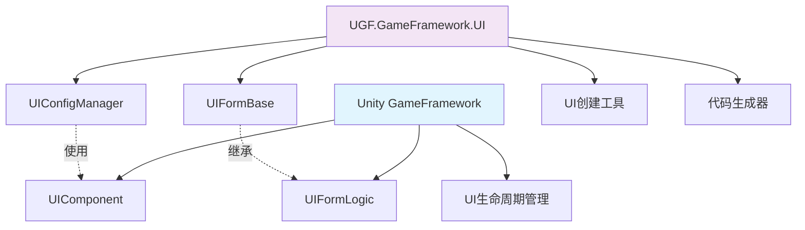
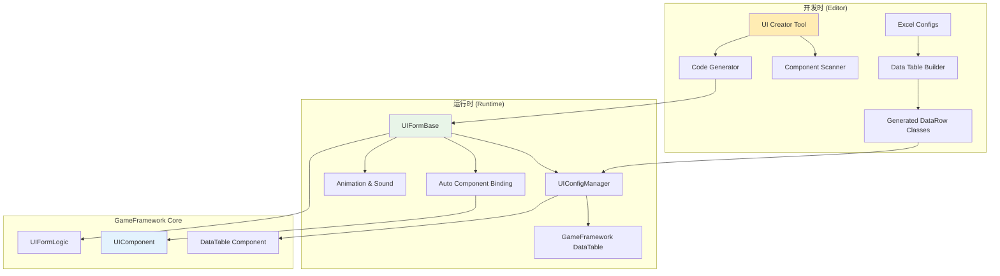
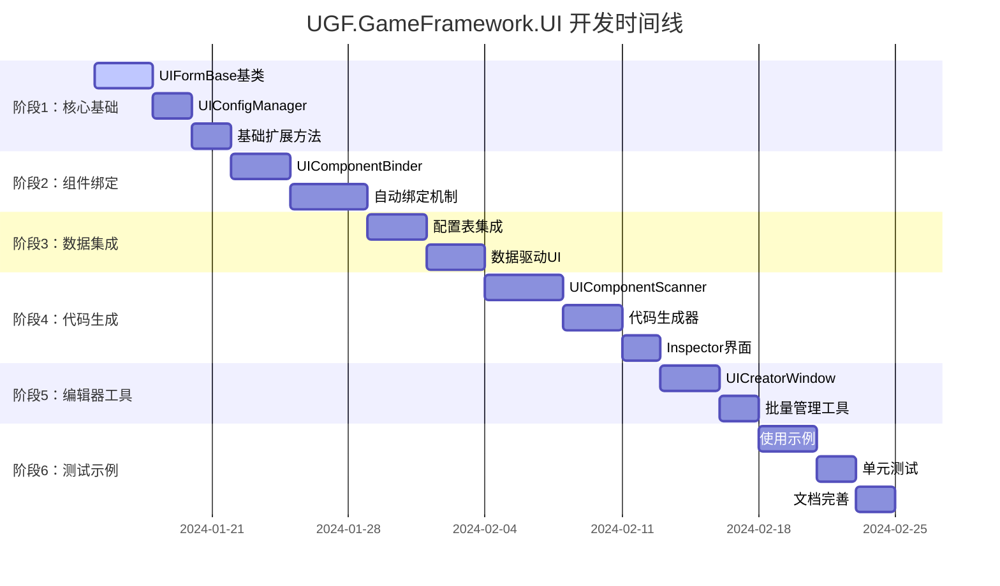
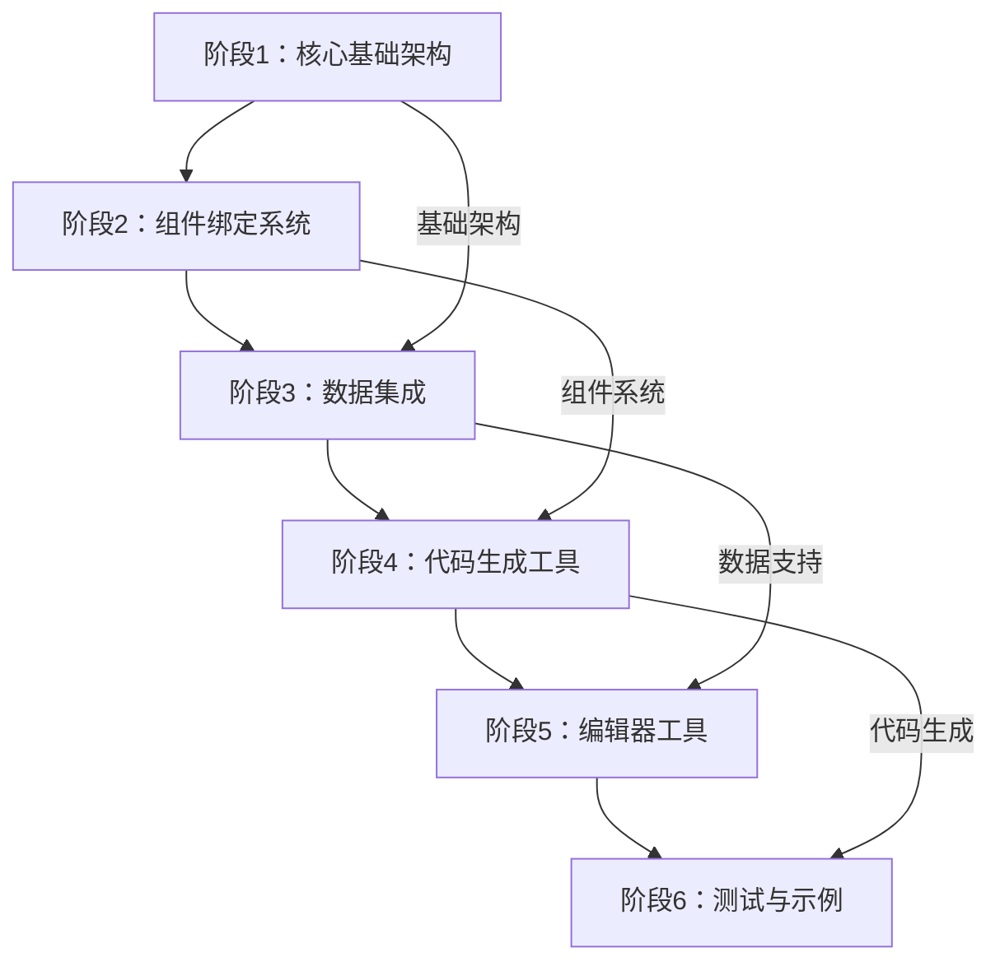
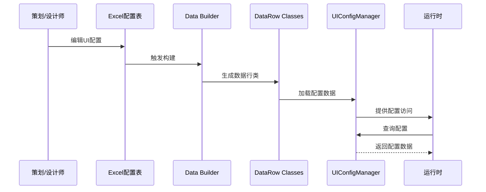
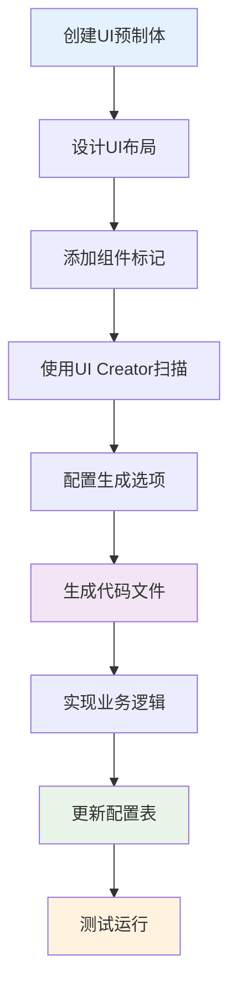

# UGF.GameFramework.UI 扩展包设计文档

## 目录

1. [项目概述](#1-项目概述)
2. [架构设计](#2-架构设计)
3. [核心组件](#3-核心组件)
4. [数据驱动系统](#4-数据驱动系统)
5. [UI创建工具链](#5-ui创建工具链)
6. [代码生成系统](#6-代码生成系统)
7. [开发工作流](#7-开发工作流)
8. [使用指南](#8-使用指南)
9. [最佳实践](#9-最佳实践)
10. [扩展与定制](#10-扩展与定制)
11. [部署与维护](#11-部署与维护)

---

## 1. 项目概述

### 1.1 项目定位

**UGF.GameFramework.UI** 是基于 Unity GameFramework 的 UI 扩展包，旨在提供：

- **数据驱动的UI开发体验**：通过Excel配置表管理UI窗体和组件
- **自动化开发工具链**：可视化UI创建工具和代码生成系统
- **增强的UI基类**：扩展GameFramework原生UI功能
- **完整的开发工作流**：从设计到部署的一站式解决方案

### 1.2 设计理念

#### 核心原则
- **不重复造轮子**：基于GameFramework原生UI模块进行扩展
- **数据驱动优先**：所有UI配置通过数据表管理
- **开发效率至上**：自动化工具减少重复劳动
- **代码质量保证**：生成高质量、可维护的代码
- **扩展性设计**：支持自定义组件和工作流

#### 技术特色
- 🎯 **零配置启动**：开箱即用的UI开发环境
- 🚀 **自动代码生成**：分部类设计，业务逻辑与UI绑定分离
- 📊 **Excel配置管理**：可视化配置，支持版本控制
- 🔧 **可视化工具**：直观的UI创建和管理界面
- 🎨 **动画音效集成**：配置化的UI表现效果

### 1.3 与GameFramework的关系



**扩展包定位**：
- **增强而非替代**：保持GameFramework原有功能完整性
- **向上兼容**：现有GameFramework UI代码无需修改
- **渐进式采用**：可以逐步迁移到扩展包功能

---

## 2. 架构设计

### 2.1 整体架构



### 2.2 模块职责

| 模块 | 职责 | 依赖关系 |
|------|------|----------|
| **UI Creator Tool** | 可视化UI创建，组件扫描，代码生成触发 | Unity Editor, GameFramework |
| **Code Generator** | 自动生成UI绑定代码和业务逻辑模板 | UI Creator Tool |
| **UIFormBase** | 扩展UI窗体基类，集成配置和自动绑定 | GameFramework UIFormLogic |
| **UIConfigManager** | UI配置数据管理，基于数据表系统 | GameFramework DataTable |
| **Data Integration** | Excel配置表解析和数据行类生成 | UGF.GameFramework.Data |

### 2.3 包结构设计

```
UGF.GameFramework.UI/
├── 📁 Runtime/                     # 运行时核心
│   ├── 📁 Core/                    # 核心功能
│   │   ├── UIFormBase.cs       # 扩展UI窗体基类
│   │   ├── UIConfigManager.cs      # 配置管理器
│   │   └── UIExtensions.cs         # 扩展方法
│   ├── 📁 Components/              # UI组件扩展
│   │   ├── UIComponentBase.cs      # 组件基类
│   │   └── UIEventTrigger.cs       # 事件触发器
│   ├── 📁 Animation/               # 动画系统
│   │   ├── UIAnimationManager.cs   # 动画管理器
│   │   └── UITweenExtensions.cs    # 动画扩展
│   └── 📁 Data/                    # 数据模型
│       ├── UIFormData.cs           # UI窗体数据
│       └── UIGroupData.cs          # UI组数据
├── 📁 Editor/                      # 编辑器工具
│   ├── 📁 Tools/                   # 开发工具
│   │   ├── UICreatorWindow.cs      # UI创建窗口
│   │   ├── UICodeGenerator.cs      # 代码生成器
│   │   └── ComponentScanner.cs     # 组件扫描器
│   ├── 📁 Templates/               # 代码模板
│   │   ├── UIFormBinding.txt       # 绑定代码模板
│   │   └── UIFormLogic.txt         # 业务逻辑模板
│   └── 📁 Inspectors/              # 检视面板
│       └── UIFormInspector.cs      # UI窗体检视面板
├── 📁 Samples~/                    # 示例项目
│   ├── 📁 BasicUI/                 # 基础UI示例
│   └── 📁 AdvancedFeatures/        # 高级功能示例
└── 📁 Documentation/               # 文档
    ├── QuickStart.md               # 快速开始
    ├── API.md                      # API文档
    └── Examples.md                 # 示例文档
```

---

## 3. 核心组件

### 3.1 UIFormBase - 扩展UI窗体基类

#### 设计目标
- 继承GameFramework的UIFormLogic，保持兼容性
- 集成配置表数据访问
- 自动化组件绑定
- 内置动画和音效支持
- 提供扩展点供业务逻辑实现
- 参考TowerDefense项目的UGuiFormEx设计

#### 核心实现

```csharp
using System;
using System.Collections.Generic;
using UnityEngine;
using UnityGameFramework.Runtime;
using GameFramework;
using GameFramework.Event;

namespace UGF.GameFramework.UI
{
    /// <summary>
    /// 扩展UI窗体基类
    /// 提供配置驱动的UI开发体验
    /// 参考TowerDefense项目的UGuiFormEx设计
    /// </summary>
    public abstract class UIFormBase : UIFormLogic
    {
        #region 配置数据
        
        /// <summary>
        /// 窗体配置数据
        /// </summary>
        protected UIFormData FormData { get; private set; }
        
        /// <summary>
        /// 是否已完成组件绑定
        /// </summary>
        protected bool IsComponentsBound { get; private set; }
        
        #endregion
        
        #region 业务逻辑代码生成
        
        private static void GenerateLogicCode(UIFormConfig config)
        {
            var filePath = Path.Combine(config.OutputPath, $"{config.FormName}.Logic.cs");
            
            // 如果文件已存在，不覆盖
            if (File.Exists(filePath))
            {
                Debug.Log($"业务逻辑文件已存在，跳过生成：{filePath}");
                return;
            }
            
            var content = GenerateLogicCodeContent(config);
            File.WriteAllText(filePath, content, Encoding.UTF8);
            Debug.Log($"业务逻辑代码已生成：{filePath}");
        }
        
        private static string GenerateLogicCodeContent(UIFormConfig config)
        {
            var sb = new StringBuilder();
            var eventComponents = config.Components.Where(c => c.Include && c.HasEvents).ToList();
            
            // 文件头部
            sb.AppendLine("//------------------------------------------------------------------------------");
            sb.AppendLine("// <auto-generated>");
            sb.AppendLine("//     此代码由UGF.GameFramework.UI代码生成器自动生成");
            sb.AppendLine("//     生成时间: " + System.DateTime.Now.ToString("yyyy-MM-dd HH:mm:ss"));
            sb.AppendLine("//     可以修改此文件以实现业务逻辑");
            sb.AppendLine("// </auto-generated>");
            sb.AppendLine("//------------------------------------------------------------------------------");
            sb.AppendLine();
            
            // Using语句
            sb.AppendLine("using UnityEngine;");
            sb.AppendLine("using GameFramework.UI;");
            sb.AppendLine("using UGF.GameFramework.UI;");
            sb.AppendLine();
            
            // 命名空间
            sb.AppendLine($"namespace {config.Namespace}");
            sb.AppendLine("{");
            
            // 类定义
            sb.AppendLine($"    /// <summary>");
            sb.AppendLine($"    /// {config.FormName} - 业务逻辑");
            sb.AppendLine($"    /// </summary>");
            sb.AppendLine($"    public partial class {config.FormName}");
            sb.AppendLine("    {");
            
            // 生命周期方法
            sb.AppendLine("        #region 生命周期");
            sb.AppendLine();
            sb.AppendLine("        /// <summary>");
            sb.AppendLine("        /// 窗体初始化");
            sb.AppendLine("        /// </summary>");
            sb.AppendLine("        /// <param name=\"userData\">用户数据</param>");
            sb.AppendLine("        protected override void OnInit(object userData)");
            sb.AppendLine("        {");
            sb.AppendLine("            base.OnInit(userData);");
            sb.AppendLine();
            sb.AppendLine("            // TODO: 实现初始化逻辑");
            sb.AppendLine("        }");
            sb.AppendLine();
            
            sb.AppendLine("        /// <summary>");
            sb.AppendLine("        /// 窗体打开");
            sb.AppendLine("        /// </summary>");
            sb.AppendLine("        /// <param name=\"userData\">用户数据</param>");
            sb.AppendLine("        protected override void OnOpen(object userData)");
            sb.AppendLine("        {");
            sb.AppendLine("            base.OnOpen(userData);");
            sb.AppendLine();
            sb.AppendLine("            // TODO: 实现打开逻辑");
            sb.AppendLine("        }");
            sb.AppendLine();
            
            sb.AppendLine("        /// <summary>");
            sb.AppendLine("        /// 窗体关闭");
            sb.AppendLine("        /// </summary>");
            sb.AppendLine("        /// <param name=\"isShutdown\">是否为关闭游戏</param>");
            sb.AppendLine("        /// <param name=\"userData\">用户数据</param>");
            sb.AppendLine("        protected override void OnClose(bool isShutdown, object userData)");
            sb.AppendLine("        {");
            sb.AppendLine("            // TODO: 实现关闭逻辑");
            sb.AppendLine();
            sb.AppendLine("            base.OnClose(isShutdown, userData);");
            sb.AppendLine("        }");
            sb.AppendLine();
            
            sb.AppendLine("        #endregion");
            
            // 事件处理方法实现
            if (eventComponents.Count > 0)
            {
                sb.AppendLine();
                sb.AppendLine("        #region 事件处理");
                sb.AppendLine();
                
                foreach (var component in eventComponents)
                {
                    GenerateEventHandlerImplementation(sb, component);
                }
                
                sb.AppendLine("        #endregion");
            }
            
            sb.AppendLine("    }");
            sb.AppendLine("}");
            
            return sb.ToString();
        }
        
        private static void GenerateEventHandlerImplementation(StringBuilder sb, ComponentInfo component)
        {
            var methodName = GetEventMethodName(component);
            
            switch (component.ComponentType)
            {
                case "Button":
                    sb.AppendLine($"        /// <summary>");
                    sb.AppendLine($"        /// {component.Path} 点击事件处理");
                    sb.AppendLine($"        /// </summary>");
                    sb.AppendLine($"        partial void On{methodName}Click()");
                    sb.AppendLine($"        {");
                    sb.AppendLine($"            // TODO: 实现按钮点击逻辑");
                    sb.AppendLine($"            Debug.Log(\"{methodName} 按钮被点击\");");
                    sb.AppendLine($"        }");
                    sb.AppendLine();
                    break;
                case "Toggle":
                    sb.AppendLine($"        /// <summary>");
                    sb.AppendLine($"        /// {component.Path} 值改变事件处理");
                    sb.AppendLine($"        /// </summary>");
                    sb.AppendLine($"        partial void On{methodName}ValueChanged(bool value)");
                    sb.AppendLine($"        {");
                    sb.AppendLine($"            // TODO: 实现Toggle值改变逻辑");
                    sb.AppendLine($"            Debug.Log($\"{methodName} Toggle值改变: {{value}}\");");
                    sb.AppendLine($"        }");
                    sb.AppendLine();
                    break;
                case "Slider":
                    sb.AppendLine($"        /// <summary>");
                    sb.AppendLine($"        /// {component.Path} 值改变事件处理");
                    sb.AppendLine($"        /// </summary>");
                    sb.AppendLine($"        partial void On{methodName}ValueChanged(float value)");
                    sb.AppendLine($"        {");
                    sb.AppendLine($"            // TODO: 实现Slider值改变逻辑");
                    sb.AppendLine($"            Debug.Log($\"{methodName} Slider值改变: {{value}}\");");
                    sb.AppendLine($"        }");
                    sb.AppendLine();
                    break;
                case "InputField":
                case "TMP_InputField":
                    sb.AppendLine($"        /// <summary>");
                    sb.AppendLine($"        /// {component.Path} 值改变事件处理");
                    sb.AppendLine($"        /// </summary>");
                    sb.AppendLine($"        partial void On{methodName}ValueChanged(string value)");
                    sb.AppendLine($"        {");
                    sb.AppendLine($"            // TODO: 实现输入框值改变逻辑");
                    sb.AppendLine($"            Debug.Log($\"{methodName} 输入框值改变: {{value}}\");");
                    sb.AppendLine($"        }");
                    sb.AppendLine();
                    sb.AppendLine($"        /// <summary>");
                    sb.AppendLine($"        /// {component.Path} 编辑结束事件处理");
                    sb.AppendLine($"        /// </summary>");
                    sb.AppendLine($"        partial void On{methodName}EndEdit(string value)");
                    sb.AppendLine($"        {");
                    sb.AppendLine($"            // TODO: 实现输入框编辑结束逻辑");
                    sb.AppendLine($"            Debug.Log($\"{methodName} 输入框编辑结束: {{value}}\");");
                    sb.AppendLine($"        }");
                    sb.AppendLine();
                    break;
                case "Dropdown":
                case "TMP_Dropdown":
                    sb.AppendLine($"        /// <summary>");
                    sb.AppendLine($"        /// {component.Path} 值改变事件处理");
                    sb.AppendLine($"        /// </summary>");
                    sb.AppendLine($"        partial void On{methodName}ValueChanged(int value)");
                    sb.AppendLine($"        {");
                    sb.AppendLine($"            // TODO: 实现下拉框值改变逻辑");
                    sb.AppendLine($"            Debug.Log($\"{methodName} 下拉框值改变: {{value}}\");");
                    sb.AppendLine($"        }");
                    sb.AppendLine();
                    break;
            }
        }
        
        #endregion
        
        #region 枚举生成
        
        private static void GenerateOrUpdateEnum(UIFormConfig config)
        {
            var enumContent = GenerateEnumCodeContent(config);
            
            // 查找现有的枚举文件
            var enumFilePath = FindEnumFile(config.OutputPath);
            
            if (string.IsNullOrEmpty(enumFilePath))
            {
                // 创建新的枚举文件
                enumFilePath = Path.Combine(config.OutputPath, "EnumUIForm.cs");
                File.WriteAllText(enumFilePath, enumContent, Encoding.UTF8);
                Debug.Log($"枚举文件已创建：{enumFilePath}");
            }
            else
            {
                // 更新现有枚举文件
                UpdateEnumFile(enumFilePath, config.FormName);
                Debug.Log($"枚举文件已更新：{enumFilePath}");
            }
        }
        
        private static string GenerateEnumCodeContent(UIFormConfig config)
        {
            var sb = new StringBuilder();
            
            // 文件头部
            sb.AppendLine("//------------------------------------------------------------------------------");
            sb.AppendLine("// <auto-generated>");
            sb.AppendLine("//     此代码由UGF.GameFramework.UI代码生成器自动生成");
            sb.AppendLine("//     生成时间: " + System.DateTime.Now.ToString("yyyy-MM-dd HH:mm:ss"));
            sb.AppendLine("//     请勿手动修改此文件");
            sb.AppendLine("// </auto-generated>");
            sb.AppendLine("//------------------------------------------------------------------------------");
            sb.AppendLine();
            
            // 命名空间
            sb.AppendLine($"namespace {config.Namespace}");
            sb.AppendLine("{");
            
            // 枚举定义
            sb.AppendLine("    /// <summary>");
            sb.AppendLine("    /// UI窗体枚举");
            sb.AppendLine("    /// </summary>");
            sb.AppendLine("    public enum EnumUIForm");
            sb.AppendLine("    {");
            sb.AppendLine($"        /// <summary>");
            sb.AppendLine($"        /// {config.FormName}");
            sb.AppendLine($"        /// </summary>");
            sb.AppendLine($"        {config.FormName},");
            sb.AppendLine("    }");
            sb.AppendLine("}");
            
            return sb.ToString();
        }
        
        private static string FindEnumFile(string outputPath)
        {
            var enumFiles = new[] { "EnumUIForm.cs", "UIFormEnum.cs", "UIEnum.cs" };
            
            foreach (var fileName in enumFiles)
            {
                var filePath = Path.Combine(outputPath, fileName);
                if (File.Exists(filePath))
                {
                    return filePath;
                }
            }
            
            return null;
        }
        
        private static void UpdateEnumFile(string filePath, string formName)
        {
            var content = File.ReadAllText(filePath);
            
            // 简单的枚举更新逻辑（在实际实现中需要更复杂的解析）
            if (!content.Contains(formName))
            {
                var insertIndex = content.LastIndexOf("}");
                if (insertIndex > 0)
                {
                    var beforeClosing = content.Substring(0, insertIndex);
                    var afterClosing = content.Substring(insertIndex);
                    
                    var newEntry = $"        /// <summary>\n        /// {formName}\n        /// </summary>\n        {formName},\n\n    ";
                    
                    var updatedContent = beforeClosing + newEntry + afterClosing;
                    File.WriteAllText(filePath, updatedContent, Encoding.UTF8);
                }
            }
        }
        
        #endregion
        
        #region 配置表更新
        
        private static void UpdateConfigTable(UIFormConfig config)
        {
            // TODO: 实现配置表更新逻辑
            // 这里需要根据实际的配置表格式来实现
            Debug.Log($"配置表更新功能待实现：{config.FormName}");
        }
        
        #endregion
        
        #region 辅助方法
        
        private static void ValidateConfig(UIFormConfig config)
        {
            if (string.IsNullOrEmpty(config.FormName))
                throw new System.ArgumentException("窗体名称不能为空");
            
            if (string.IsNullOrEmpty(config.Namespace))
                throw new System.ArgumentException("命名空间不能为空");
            
            if (string.IsNullOrEmpty(config.OutputPath))
                throw new System.ArgumentException("输出路径不能为空");
            
            if (config.Prefab == null)
                throw new System.ArgumentException("预制体不能为空");
        }
        
        private static void EnsureDirectoryExists(string path)
        {
            if (!Directory.Exists(path))
            {
                Directory.CreateDirectory(path);
            }
        }
        
        #endregion
    }
    
    /// <summary>
    /// 代码预览数据
    /// </summary>
    public class UICodePreview
    {
        /// <summary>
        /// 绑定代码
        /// </summary>
        public string BindingCode { get; set; }
        
        /// <summary>
        /// 业务逻辑代码
        /// </summary>
        public string LogicCode { get; set; }
        
        /// <summary>
        /// 枚举代码
        /// </summary>
        public string EnumCode { get; set; }
    }
}
```

### 6.3 UICodePreviewWindow - 代码预览窗口

```csharp
using UnityEngine;
using UnityEditor;
using System.Text;

namespace UGF.GameFramework.UI.Editor
{
    /// <summary>
    /// UI代码预览窗口
    /// 用于预览生成的代码
    /// </summary>
    public class UICodePreviewWindow : EditorWindow
    {
        private UICodePreview m_Preview;
        private Vector2 m_ScrollPosition;
        private int m_SelectedTab = 0;
        private readonly string[] m_TabNames = { "绑定代码", "业务逻辑", "枚举定义" };
        
        public static UICodePreviewWindow ShowWindow()
        {
            var window = GetWindow<UICodePreviewWindow>("代码预览");
            window.minSize = new Vector2(800, 600);
            window.Show();
            return window;
        }
        
        public void SetPreviewConfig(UIFormConfig config)
        {
            m_Preview = UICodeGenerator.PreviewCode(config);
            Repaint();
        }
        
        private void OnGUI()
        {
            if (m_Preview == null)
            {
                EditorGUILayout.HelpBox("没有可预览的代码", MessageType.Info);
                return;
            }
            
            // 标签页
            m_SelectedTab = GUILayout.Toolbar(m_SelectedTab, m_TabNames);
            
            EditorGUILayout.Space(5);
            
            // 代码显示区域
            m_ScrollPosition = EditorGUILayout.BeginScrollView(m_ScrollPosition);
            
            string codeContent = "";
            switch (m_SelectedTab)
            {
                case 0:
                    codeContent = m_Preview.BindingCode ?? "未生成绑定代码";
                    break;
                case 1:
                    codeContent = m_Preview.LogicCode ?? "未生成业务逻辑代码";
                    break;
                case 2:
                    codeContent = m_Preview.EnumCode ?? "未生成枚举代码";
                    break;
            }
            
            // 使用文本区域显示代码
            var style = new GUIStyle(EditorStyles.textArea)
            {
                font = EditorGUIUtility.Load("consolas.ttf") as Font ?? GUI.skin.font,
                fontSize = 12
            };
            
            EditorGUILayout.TextArea(codeContent, style, GUILayout.ExpandHeight(true));
            
            EditorGUILayout.EndScrollView();
            
            // 底部按钮
            EditorGUILayout.Space(5);
            using (new EditorGUILayout.HorizontalScope())
            {
                if (GUILayout.Button("复制到剪贴板"))
                {
                    EditorGUIUtility.systemCopyBuffer = codeContent;
                    ShowNotification(new GUIContent("代码已复制到剪贴板"));
                }
                
                if (GUILayout.Button("关闭"))
                {
                    Close();
                }
            }
        }
    }
 }
 ```
 
 ### 6.4 UIBatchGenerator - 批量生成器
 
 ```csharp
 using UnityEngine;
 using UnityEditor;
 using System.Collections.Generic;
 using System.IO;
 using System.Linq;
 
 namespace UGF.GameFramework.UI.Editor
 {
     /// <summary>
     /// UI批量生成器
     /// 用于批量生成多个UI窗体的代码
     /// </summary>
     public static class UIBatchGenerator
     {
         /// <summary>
         /// 批量生成UI窗体
         /// </summary>
         /// <param name="configs">配置列表</param>
         /// <param name="progressCallback">进度回调</param>
         public static void BatchGenerateUIForms(List<UIFormConfig> configs, System.Action<int, int, string> progressCallback = null)
         {
             if (configs == null || configs.Count == 0)
             {
                 Debug.LogWarning("没有可生成的UI窗体配置");
                 return;
             }
             
             var successCount = 0;
             var failureCount = 0;
             
             for (int i = 0; i < configs.Count; i++)
             {
                 var config = configs[i];
                 progressCallback?.Invoke(i + 1, configs.Count, config.FormName);
                 
                 try
                 {
                     UICodeGenerator.GenerateUIForm(config);
                     successCount++;
                     Debug.Log($"成功生成UI窗体：{config.FormName}");
                 }
                 catch (System.Exception ex)
                 {
                     failureCount++;
                     Debug.LogError($"生成UI窗体失败：{config.FormName}，错误：{ex.Message}");
                 }
             }
             
             Debug.Log($"批量生成完成：成功 {successCount} 个，失败 {failureCount} 个");
             AssetDatabase.Refresh();
         }
         
         /// <summary>
         /// 从目录扫描UI预制体
         /// </summary>
         /// <param name="directory">目录路径</param>
         /// <param name="recursive">是否递归扫描</param>
         /// <returns>预制体列表</returns>
         public static List<GameObject> ScanUIPrefabs(string directory, bool recursive = true)
         {
             var prefabs = new List<GameObject>();
             
             if (!Directory.Exists(directory))
             {
                 Debug.LogWarning($"目录不存在：{directory}");
                 return prefabs;
             }
             
             var searchOption = recursive ? SearchOption.AllDirectories : SearchOption.TopDirectoryOnly;
             var prefabFiles = Directory.GetFiles(directory, "*.prefab", searchOption);
             
             foreach (var file in prefabFiles)
             {
                 var assetPath = file.Replace('\\', '/').Replace(Application.dataPath, "Assets");
                 var prefab = AssetDatabase.LoadAssetAtPath<GameObject>(assetPath);
                 
                 if (prefab != null && IsUIPrefab(prefab))
                 {
                     prefabs.Add(prefab);
                 }
             }
             
             return prefabs;
         }
         
         /// <summary>
         /// 判断是否为UI预制体
         /// </summary>
         /// <param name="prefab">预制体</param>
         /// <returns>是否为UI预制体</returns>
         private static bool IsUIPrefab(GameObject prefab)
         {
             // 检查是否有Canvas或RectTransform组件
             return prefab.GetComponent<Canvas>() != null || 
                    prefab.GetComponent<RectTransform>() != null;
         }
         
         /// <summary>
         /// 创建批量生成配置
         /// </summary>
         /// <param name="prefabs">预制体列表</param>
         /// <param name="baseConfig">基础配置</param>
         /// <returns>配置列表</returns>
         public static List<UIFormConfig> CreateBatchConfigs(List<GameObject> prefabs, UIFormConfig baseConfig)
         {
             var configs = new List<UIFormConfig>();
             
             foreach (var prefab in prefabs)
             {
                 var config = new UIFormConfig
                 {
                     Prefab = prefab,
                     FormName = prefab.name,
                     Namespace = baseConfig.Namespace,
                     OutputPath = baseConfig.OutputPath,
                     UIGroup = baseConfig.UIGroup,
                     Priority = baseConfig.Priority,
                     AllowMultiInstance = baseConfig.AllowMultiInstance,
                     PauseCoveredUIForm = baseConfig.PauseCoveredUIForm,
                     GenerateBinding = baseConfig.GenerateBinding,
                     GenerateLogic = baseConfig.GenerateLogic,
                     GenerateEnum = baseConfig.GenerateEnum,
                     UpdateConfigTable = baseConfig.UpdateConfigTable
                 };
                 
                 // 扫描组件
                 config.Components = ComponentScanner.ScanComponents(prefab);
                 
                 configs.Add(config);
             }
             
             return configs;
         }
     }
 }
 ```
 
 ### 6.5 UIConfigValidator - 配置验证器
 
 ```csharp
 using UnityEngine;
 using System.Collections.Generic;
 using System.Linq;
 using System.Text;
 
 namespace UGF.GameFramework.UI.Editor
 {
     /// <summary>
     /// UI配置验证器
     /// 用于验证UI配置的正确性
     /// </summary>
     public static class UIConfigValidator
     {
         /// <summary>
         /// 验证结果
         /// </summary>
         public class ValidationResult
         {
             /// <summary>
             /// 是否有效
             /// </summary>
             public bool IsValid { get; set; }
             
             /// <summary>
             /// 错误信息列表
             /// </summary>
             public List<string> Errors { get; set; } = new List<string>();
             
             /// <summary>
             /// 警告信息列表
             /// </summary>
             public List<string> Warnings { get; set; } = new List<string>();
         }
         
         /// <summary>
         /// 验证UI窗体配置
         /// </summary>
         /// <param name="config">配置</param>
         /// <returns>验证结果</returns>
         public static ValidationResult ValidateUIFormConfig(UIFormConfig config)
         {
             var result = new ValidationResult { IsValid = true };
             
             // 基础验证
             ValidateBasicConfig(config, result);
             
             // 组件验证
             ValidateComponents(config, result);
             
             // 路径验证
             ValidatePaths(config, result);
             
             // 命名验证
             ValidateNaming(config, result);
             
             result.IsValid = result.Errors.Count == 0;
             return result;
         }
         
         /// <summary>
         /// 验证基础配置
         /// </summary>
         private static void ValidateBasicConfig(UIFormConfig config, ValidationResult result)
         {
             if (config == null)
             {
                 result.Errors.Add("配置对象为空");
                 return;
             }
             
             if (config.Prefab == null)
             {
                 result.Errors.Add("预制体不能为空");
             }
             
             if (string.IsNullOrEmpty(config.FormName))
             {
                 result.Errors.Add("窗体名称不能为空");
             }
             else if (!IsValidClassName(config.FormName))
             {
                 result.Errors.Add($"窗体名称 '{config.FormName}' 不是有效的C#类名");
             }
             
             if (string.IsNullOrEmpty(config.Namespace))
             {
                 result.Errors.Add("命名空间不能为空");
             }
             else if (!IsValidNamespace(config.Namespace))
             {
                 result.Errors.Add($"命名空间 '{config.Namespace}' 格式不正确");
             }
             
             if (string.IsNullOrEmpty(config.OutputPath))
             {
                 result.Errors.Add("输出路径不能为空");
             }
             
             if (config.Priority < 0)
             {
                 result.Warnings.Add("优先级为负数，可能导致显示顺序问题");
             }
         }
         
         /// <summary>
         /// 验证组件配置
         /// </summary>
         private static void ValidateComponents(UIFormConfig config, ValidationResult result)
         {
             if (config.Components == null || config.Components.Count == 0)
             {
                 result.Warnings.Add("没有扫描到任何UI组件");
                 return;
             }
             
             var includedComponents = config.Components.Where(c => c.Include).ToList();
             if (includedComponents.Count == 0)
             {
                 result.Warnings.Add("没有选择任何组件进行绑定");
             }
             
             // 检查变量名冲突
             var variableNames = new HashSet<string>();
             foreach (var component in includedComponents)
             {
                 if (string.IsNullOrEmpty(component.VariableName))
                 {
                     result.Errors.Add($"组件 '{component.Path}' 的变量名不能为空");
                     continue;
                 }
                 
                 if (!IsValidVariableName(component.VariableName))
                 {
                     result.Errors.Add($"组件 '{component.Path}' 的变量名 '{component.VariableName}' 不是有效的C#变量名");
                 }
                 
                 if (variableNames.Contains(component.VariableName))
                 {
                     result.Errors.Add($"变量名 '{component.VariableName}' 重复");
                 }
                 else
                 {
                     variableNames.Add(component.VariableName);
                 }
             }
         }
         
         /// <summary>
         /// 验证路径配置
         /// </summary>
         private static void ValidatePaths(UIFormConfig config, ValidationResult result)
         {
             if (!string.IsNullOrEmpty(config.OutputPath))
             {
                 if (!config.OutputPath.StartsWith("Assets/"))
                 {
                     result.Errors.Add("输出路径必须以 'Assets/' 开头");
                 }
             }
         }
         
         /// <summary>
         /// 验证命名规范
         /// </summary>
         private static void ValidateNaming(UIFormConfig config, ValidationResult result)
         {
             // 检查命名规范
             if (!string.IsNullOrEmpty(config.FormName))
             {
                 if (!char.IsUpper(config.FormName[0]))
                 {
                     result.Warnings.Add("建议窗体名称以大写字母开头");
                 }
                 
                 if (config.FormName.Contains("_"))
                 {
                     result.Warnings.Add("建议使用PascalCase命名规范，避免使用下划线");
                 }
             }
         }
         
         /// <summary>
         /// 检查是否为有效的C#类名
         /// </summary>
         private static bool IsValidClassName(string name)
         {
             if (string.IsNullOrEmpty(name))
                 return false;
             
             // 简单的类名验证
             return System.Text.RegularExpressions.Regex.IsMatch(name, @"^[A-Za-z_][A-Za-z0-9_]*$") &&
                    !IsReservedKeyword(name);
         }
         
         /// <summary>
         /// 检查是否为有效的命名空间
         /// </summary>
         private static bool IsValidNamespace(string ns)
         {
             if (string.IsNullOrEmpty(ns))
                 return false;
             
             var parts = ns.Split('.');
             return parts.All(part => IsValidClassName(part));
         }
         
         /// <summary>
         /// 检查是否为有效的变量名
         /// </summary>
         private static bool IsValidVariableName(string name)
         {
             if (string.IsNullOrEmpty(name))
                 return false;
             
             return System.Text.RegularExpressions.Regex.IsMatch(name, @"^[a-zA-Z_][a-zA-Z0-9_]*$") &&
                    !IsReservedKeyword(name);
         }
         
         /// <summary>
         /// 检查是否为C#保留关键字
         /// </summary>
         private static bool IsReservedKeyword(string word)
         {
             var keywords = new HashSet<string>
             {
                 "abstract", "as", "base", "bool", "break", "byte", "case", "catch", "char", "checked",
                 "class", "const", "continue", "decimal", "default", "delegate", "do", "double", "else",
                 "enum", "event", "explicit", "extern", "false", "finally", "fixed", "float", "for",
                 "foreach", "goto", "if", "implicit", "in", "int", "interface", "internal", "is", "lock",
                 "long", "namespace", "new", "null", "object", "operator", "out", "override", "params",
                 "private", "protected", "public", "readonly", "ref", "return", "sbyte", "sealed",
                 "short", "sizeof", "stackalloc", "static", "string", "struct", "switch", "this",
                 "throw", "true", "try", "typeof", "uint", "ulong", "unchecked", "unsafe", "ushort",
                 "using", "virtual", "void", "volatile", "while"
             };
             
             return keywords.Contains(word.ToLower());
         }
         
         /// <summary>
         /// 格式化验证结果
         /// </summary>
         /// <param name="result">验证结果</param>
         /// <returns>格式化的字符串</returns>
         public static string FormatValidationResult(ValidationResult result)
         {
             var sb = new StringBuilder();
             
             if (result.IsValid)
             {
                 sb.AppendLine("✓ 配置验证通过");
             }
             else
             {
                 sb.AppendLine("✗ 配置验证失败");
             }
             
             if (result.Errors.Count > 0)
             {
                 sb.AppendLine();
                 sb.AppendLine("错误：");
                 foreach (var error in result.Errors)
                 {
                     sb.AppendLine($"  • {error}");
                 }
             }
             
             if (result.Warnings.Count > 0)
             {
                 sb.AppendLine();
                 sb.AppendLine("警告：");
                 foreach (var warning in result.Warnings)
                 {
                     sb.AppendLine($"  • {warning}");
                 }
             }
             
             return sb.ToString();
         }
     }
 }
 ```
 
 ## 7. 使用示例
 
 ### 7.1 基础使用流程
 
 #### 步骤1：创建UI预制体
 
 1. 在Unity中创建一个新的Canvas
 2. 设计UI布局，添加所需的UI组件（Button、Text、Image等）
 3. 为需要代码访问的组件添加`UIComponentBinder`组件
 4. 保存为预制体
 
 #### 步骤2：使用UI创建工具
 
 ```csharp
 // 打开UI创建工具
 // 菜单：Tools -> UGF -> UI Creator
 
 // 1. 选择预制体
 // 2. 设置窗体名称和命名空间
 // 3. 配置输出路径
 // 4. 设置GameFramework参数
 // 5. 扫描组件
 // 6. 选择要绑定的组件
 // 7. 生成代码
 ```
 
 #### 步骤3：实现业务逻辑
 
 ```csharp
 // 生成的业务逻辑文件示例
 namespace Game.UI
 {
     public partial class MainMenuForm
     {
         protected override void OnInit(object userData)
         {
             base.OnInit(userData);
             
             // 初始化逻辑
             UpdatePlayerInfo();
         }
         
         protected override void OnOpen(object userData)
         {
             base.OnOpen(userData);
             
             // 打开时的逻辑
             PlayOpenAnimation();
         }
         
         partial void OnStartButtonClick()
         {
             // 开始游戏按钮点击
             GameEntry.UI.OpenUIForm(EnumUIForm.GameplayForm);
         }
         
         partial void OnSettingsButtonClick()
         {
             // 设置按钮点击
             GameEntry.UI.OpenUIForm(EnumUIForm.SettingsForm);
         }
         
         private void UpdatePlayerInfo()
         {
             // 更新玩家信息显示
             m_PlayerNameText.text = GameEntry.Player.Name;
             m_PlayerLevelText.text = $"Lv.{GameEntry.Player.Level}";
         }
     }
 }
 ```
 
 ### 7.2 高级使用示例
 
 #### 动态UI管理
 
 ```csharp
 // 使用枚举方式打开UI
 GameEntry.UI.OpenUIForm(EnumUIForm.MainMenu);
 
 // 传递用户数据
 var userData = new MainMenuData { PlayerName = "Player1" };
 GameEntry.UI.OpenUIForm(EnumUIForm.MainMenu, userData);
 
 // 检查UI是否打开
 if (GameEntry.UI.IsUIFormOpen(EnumUIForm.MainMenu))
 {
     // UI已打开
 }
 
 // 获取UI实例
 var mainMenu = GameEntry.UI.GetUIForm<MainMenuForm>(EnumUIForm.MainMenu);
 if (mainMenu != null)
 {
     mainMenu.UpdateDisplay();
 }
 ```
 
 #### 批量生成UI
 
 ```csharp
 // 扫描UI预制体目录
 var prefabs = UIBatchGenerator.ScanUIPrefabs("Assets/UI/Prefabs", true);
 
 // 创建批量配置
 var baseConfig = new UIFormConfig
 {
     Namespace = "Game.UI",
     OutputPath = "Assets/Scripts/UI",
     UIGroup = "Default",
     Priority = 0,
     GenerateBinding = true,
     GenerateLogic = true,
     GenerateEnum = true
 };
 
 var configs = UIBatchGenerator.CreateBatchConfigs(prefabs, baseConfig);
 
 // 批量生成
 UIBatchGenerator.BatchGenerateUIForms(configs, (current, total, name) =>
 {
     Debug.Log($"正在生成 {current}/{total}: {name}");
 });
 ```
 
 #### 配置验证
 
 ```csharp
 // 验证配置
 var result = UIConfigValidator.ValidateUIFormConfig(config);
 
 if (!result.IsValid)
 {
     var message = UIConfigValidator.FormatValidationResult(result);
     Debug.LogError(message);
     return;
 }
 
 // 配置有效，继续生成
 UICodeGenerator.GenerateUIForm(config);
 ```
 
 ### 7.3 自定义扩展
 
 #### 自定义组件类型支持
 
 ```csharp
 // 扩展ComponentScanner以支持自定义组件
 public static class CustomComponentScanner
 {
     public static void RegisterCustomComponent<T>(string typeName, bool hasEvents = false) where T : Component
     {
         ComponentScanner.RegisterComponentType(typeof(T), typeName, hasEvents);
     }
 }
 
 // 注册自定义组件
 CustomComponentScanner.RegisterCustomComponent<CustomButton>("CustomButton", true);
 ```
 
 #### 自定义代码模板
 
 ```csharp
 // 自定义代码生成模板
 public static class CustomCodeTemplates
 {
     public static string GetCustomBindingTemplate(UIFormConfig config)
     {
         // 返回自定义的绑定代码模板
         return "// 自定义绑定代码模板";
     }
 }
 ```
 
 ## 8. 最佳实践
 
 ### 8.1 项目结构建议
 
 ```
 Assets/
 ├── Scripts/
 │   ├── UI/
 │   │   ├── Forms/           # UI窗体代码
 │   │   ├── Enums/           # UI枚举定义
 │   │   └── Data/            # UI数据类
 │   └── Game/
 ├── UI/
 │   ├── Prefabs/             # UI预制体
 │   ├── Textures/            # UI贴图
 │   └── Fonts/               # 字体文件
 └── StreamingAssets/
     └── DataTables/          # 配置表文件
 ```
 
 ### 8.2 命名规范
 
 - **窗体类名**：使用PascalCase，以"Form"结尾，如`MainMenuForm`
 - **枚举值**：使用PascalCase，与窗体类名保持一致，如`MainMenuForm`
 - **变量名**：使用camelCase，添加前缀`m_`，如`m_startButton`
 - **事件方法**：使用PascalCase，以"On"开头，如`OnStartButtonClick`
 
 ### 8.3 性能优化建议
 
 1. **组件缓存**：合理使用组件绑定，避免频繁的`GetComponent`调用
 2. **事件管理**：及时注销事件监听，防止内存泄漏
 3. **资源管理**：使用对象池管理频繁创建销毁的UI
 4. **异步加载**：对于复杂UI，考虑使用异步加载
 
 ### 8.4 调试技巧
 
 1. **日志输出**：在关键方法中添加日志输出
 2. **配置验证**：使用配置验证器检查配置正确性
 3. **代码预览**：生成前先预览代码，确认无误
 4. **增量生成**：支持增量更新，避免覆盖手动修改的代码
 
 ## 9. 故障排除
 
 ### 9.1 常见问题
 
 #### 问题1：生成的代码编译错误
 
 **原因**：
 - 命名空间冲突
 - 变量名重复
 - 使用了C#保留关键字
 
 **解决方案**：
 - 使用配置验证器检查配置
 - 修改冲突的命名
 - 避免使用保留关键字
 
 #### 问题2：UI组件绑定失败
 
 **原因**：
 - 组件路径错误
 - 预制体结构发生变化
 - 组件类型不匹配
 
 **解决方案**：
 - 重新扫描组件
 - 检查预制体结构
 - 确认组件类型正确
 
 #### 问题3：事件绑定不生效
 
 **原因**：
 - 事件方法未实现
 - 方法签名不匹配
 - 事件绑定代码错误
 
 **解决方案**：
 - 检查事件方法实现
 - 确认方法签名正确
 - 重新生成绑定代码
 
 ### 9.2 调试工具
 
 #### UI配置检查器
 
 ```csharp
 [MenuItem("Tools/UGF/UI Config Inspector")]
 public static void ShowConfigInspector()
 {
     // 显示配置检查器窗口
     UIConfigInspectorWindow.ShowWindow();
 }
 ```
 
 #### 组件绑定测试器
 
 ```csharp
 [MenuItem("Tools/UGF/Test Component Binding")]
 public static void TestComponentBinding()
 {
     // 测试组件绑定是否正确
     var selectedObject = Selection.activeGameObject;
     if (selectedObject != null)
     {
         ComponentBindingTester.TestBinding(selectedObject);
     }
 }
 ```
 
 ## 10. 版本更新说明
 
 ### v1.0.0 (初始版本)
 - 基础UI扩展功能
 - 代码生成系统
 - 配置表集成
 
 ### v1.1.0 (计划中)
 - 支持更多UI组件类型
 - 增强的代码模板系统
 - 可视化配置编辑器
 - 性能分析工具
 
 ### v1.2.0 (计划中)
 - 多语言支持
 - 主题系统
 - 动画集成
 - 移动端适配优化
 
 ## 11. 技术支持
 
 ### 11.1 文档资源
 
 - [UGF官方文档](https://github.com/EllanJiang/UnityGameFramework)
 - [GameFramework文档](https://github.com/EllanJiang/GameFramework)
 - [Unity UI系统文档](https://docs.unity3d.com/Manual/UISystem.html)
 
 ### 11.2 社区支持
 
 - GitHub Issues：报告问题和建议
 - 技术交流群：实时讨论和答疑
 - 官方论坛：深度技术讨论
 
 ### 11.3 贡献指南
 
 欢迎社区贡献代码和文档：
 
 1. Fork项目仓库
 2. 创建功能分支
 3. 提交代码更改
 4. 创建Pull Request
 5. 等待代码审查
 
 ---
 
 **UGF.GameFramework.UI扩展包** 致力于为Unity游戏开发提供高效、易用的UI开发解决方案。通过本文档的详细说明，开发者可以快速上手并充分利用扩展包的各项功能，提升UI开发效率和代码质量。
         
         #region 事件管理
        
        /// <summary>
        /// 事件订阅器，用于统一管理事件订阅
        /// </summary>
        protected EventSubscriber EventSubscriber { get; private set; }
        
        #endregion
        
        #region 资源管理
        
        /// <summary>
        /// 物品加载器，用于管理UI中的物品显示
        /// </summary>
        protected ItemLoader ItemLoader { get; private set; }
        
        /// <summary>
        /// 实体加载器，用于管理UI中的实体显示
        /// </summary>
        protected EntityLoader EntityLoader { get; private set; }
        
        #endregion
        
        #region 生命周期扩展点
        
        /// <summary>
        /// 扩展初始化 - 在组件绑定完成后调用
        /// </summary>
        /// <param name="userData">用户数据</param>
        protected virtual void OnInitExtended(object userData) { }
        
        /// <summary>
        /// 扩展打开 - 在动画播放前调用
        /// </summary>
        /// <param name="userData">用户数据</param>
        protected virtual void OnOpenExtended(object userData) { }
        
        /// <summary>
        /// 扩展关闭 - 在动画播放前调用
        /// </summary>
        /// <param name="isShutdown">是否为关闭程序</param>
        /// <param name="userData">用户数据</param>
        protected virtual void OnCloseExtended(bool isShutdown, object userData) { }
        
        /// <summary>
        /// 扩展暂停
        /// </summary>
        protected virtual void OnPauseExtended() { }
        
        /// <summary>
        /// 扩展恢复
        /// </summary>
        protected virtual void OnResumeExtended() { }
        
        #endregion
        
        #region 自动绑定系统
        
        /// <summary>
        /// 自动组件绑定 - 由代码生成器生成实现
        /// </summary>
        protected virtual void BindComponents() { }
        
        /// <summary>
        /// 业务逻辑初始化 - 由开发者实现
        /// </summary>
        protected virtual void InitializeLogic() { }
        
        /// <summary>
        /// 注册UI事件 - 由开发者实现
        /// </summary>
        protected virtual void RegisterUIEvents() { }
        
        /// <summary>
        /// 注销UI事件 - 由开发者实现
        /// </summary>
        protected virtual void UnregisterUIEvents() { }
        
        #endregion
        
        #region 事件管理方法
        
        /// <summary>
        /// 订阅事件
        /// </summary>
        protected void SubscribeEvent<T>(EventHandler<T> handler) where T : GameEventArgs
        {
            EventSubscriber?.Subscribe(handler);
        }
        
        /// <summary>
        /// 取消订阅事件
        /// </summary>
        protected void UnsubscribeEvent<T>(EventHandler<T> handler) where T : GameEventArgs
        {
            EventSubscriber?.Unsubscribe(handler);
        }
        
        /// <summary>
        /// 触发事件
        /// </summary>
        protected void FireEvent<T>(object sender, T eventArgs) where T : GameEventArgs
        {
            GameEntry.Event?.Fire(sender, eventArgs);
        }
        
        #endregion
        
        #region 资源管理方法
        
        /// <summary>
        /// 显示物品
        /// </summary>
        protected void ShowItem(int itemId, Transform parent = null)
        {
            ItemLoader?.ShowItem(itemId, parent);
        }
        
        /// <summary>
        /// 隐藏物品
        /// </summary>
        protected void HideItem(int itemId)
        {
            ItemLoader?.HideItem(itemId);
        }
        
        /// <summary>
        /// 检查物品是否存在
        /// </summary>
        protected bool HasItem(int itemId)
        {
            return ItemLoader?.HasItem(itemId) ?? false;
        }
        
        /// <summary>
        /// 显示实体
        /// </summary>
        protected void ShowEntity(int entityId, Transform parent = null)
        {
            EntityLoader?.ShowEntity(entityId, parent);
        }
        
        /// <summary>
        /// 隐藏实体
        /// </summary>
        protected void HideEntity(int entityId)
        {
            EntityLoader?.HideEntity(entityId);
        }
        
        /// <summary>
        /// 检查实体是否存在
        /// </summary>
        protected bool HasEntity(int entityId)
        {
            return EntityLoader?.HasEntity(entityId) ?? false;
        }
        
        #endregion
        
        #region 动画和音效
        
        /// <summary>
        /// 播放打开动画
        /// </summary>
        protected virtual void PlayOpenAnimation()
        {
            if (FormData?.OpenAnimationType != null)
            {
                UIAnimationManager.Instance.PlayAnimation(
                    gameObject, 
                    FormData.OpenAnimationType,
                    FormData.OpenAnimationDuration
                );
            }
        }
        
        /// <summary>
        /// 播放关闭动画
        /// </summary>
        protected virtual void PlayCloseAnimation()
        {
            if (FormData?.CloseAnimationType != null)
            {
                UIAnimationManager.Instance.PlayAnimation(
                    gameObject, 
                    FormData.CloseAnimationType,
                    FormData.CloseAnimationDuration
                );
            }
        }
        
        /// <summary>
        /// 播放UI音效
        /// </summary>
        /// <param name="soundName">音效名称</param>
        protected virtual void PlayUISound(string soundName)
        {
            if (!string.IsNullOrEmpty(soundName))
            {
                GameEntry.Sound?.PlayUISound(soundName);
            }
        }
        
        #endregion
        
        #region GameFramework生命周期重写
        
        protected sealed override void OnInit(object userData)
        {
            base.OnInit(userData);
            
            // 1. 初始化管理器
            InitializeManagers();
            
            // 2. 加载配置数据
            LoadFormData();
            
            // 3. 自动绑定组件
            if (!IsComponentsBound)
            {
                BindComponents();
                IsComponentsBound = true;
            }
            
            // 4. 初始化业务逻辑
            InitializeLogic();
            
            // 5. 注册UI事件
            RegisterUIEvents();
            
            // 6. 调用扩展初始化
            OnInitExtended(userData);
        }
        
        protected sealed override void OnOpen(object userData)
        {
            base.OnOpen(userData);
            
            // 1. 播放打开音效
            if (FormData?.OpenSoundName != null)
            {
                PlayUISound(FormData.OpenSoundName);
            }
            
            // 2. 调用扩展打开
            OnOpenExtended(userData);
            
            // 3. 播放打开动画
            PlayOpenAnimation();
        }
        
        protected sealed override void OnClose(bool isShutdown, object userData)
        {
            // 1. 播放关闭音效
            if (!isShutdown && FormData?.CloseSoundName != null)
            {
                PlayUISound(FormData.CloseSoundName);
            }
            
            // 2. 调用扩展关闭
            OnCloseExtended(isShutdown, userData);
            
            // 3. 播放关闭动画
            if (!isShutdown)
            {
                PlayCloseAnimation();
            }
            
            // 4. 注销UI事件
            UnregisterUIEvents();
            
            // 5. 清理资源
            CleanupResources();
            
            base.OnClose(isShutdown, userData);
        }
        
        protected sealed override void OnPause()
        {
            base.OnPause();
            OnPauseExtended();
        }
        
        protected sealed override void OnResume()
        {
            base.OnResume();
            OnResumeExtended();
        }
        
        #endregion
        
        #region 私有方法
        
        /// <summary>
        /// 初始化管理器
        /// </summary>
        private void InitializeManagers()
        {
            EventSubscriber = new EventSubscriber(GameEntry.Event);
            ItemLoader = new ItemLoader();
            EntityLoader = new EntityLoader();
        }
        
        /// <summary>
        /// 加载窗体配置数据
        /// </summary>
        private void LoadFormData()
        {
            string formName = GetType().Name;
            FormData = UIConfigManager.Instance.GetUIFormDataByName(formName);
            
            if (FormData == null)
            {
                Log.Warning($"未找到UI窗体 '{formName}' 的配置数据");
            }
        }
        
        /// <summary>
        /// 清理资源
        /// </summary>
        private void CleanupResources()
        {
            // 清理事件订阅
            EventSubscriber?.UnsubscribeAll();
            
            // 清理物品和实体
            ItemLoader?.HideAllItems();
            EntityLoader?.HideAllEntities();
        }
        
        #endregion
    }
    
    #region 辅助类定义
    
    /// <summary>
    /// 事件订阅器
    /// 用于统一管理UI窗体的事件订阅
    /// </summary>
    public class EventSubscriber
    {
        private readonly EventComponent m_EventComponent;
        private readonly List<(Type eventType, Delegate handler)> m_Subscriptions = new List<(Type, Delegate)>();
        
        public EventSubscriber(EventComponent eventComponent)
        {
            m_EventComponent = eventComponent;
        }
        
        public void Subscribe<T>(EventHandler<T> handler) where T : GameEventArgs
        {
            if (m_EventComponent != null)
            {
                m_EventComponent.Subscribe(handler);
                m_Subscriptions.Add((typeof(T), handler));
            }
        }
        
        public void Unsubscribe<T>(EventHandler<T> handler) where T : GameEventArgs
        {
            if (m_EventComponent != null)
            {
                m_EventComponent.Unsubscribe(handler);
                m_Subscriptions.RemoveAll(s => s.eventType == typeof(T) && s.handler.Equals(handler));
            }
        }
        
        public void UnsubscribeAll()
        {
            if (m_EventComponent != null)
            {
                foreach (var (eventType, handler) in m_Subscriptions)
                {
                    // 使用反射取消订阅
                    var unsubscribeMethod = m_EventComponent.GetType().GetMethod("Unsubscribe");
                    var genericMethod = unsubscribeMethod?.MakeGenericMethod(eventType);
                    genericMethod?.Invoke(m_EventComponent, new object[] { handler });
                }
            }
            m_Subscriptions.Clear();
        }
    }
    
    /// <summary>
    /// 物品加载器
    /// 用于管理UI中的物品显示
    /// </summary>
    public class ItemLoader
    {
        private readonly Dictionary<int, GameObject> m_LoadedItems = new Dictionary<int, GameObject>();
        
        public void ShowItem(int itemId, Transform parent = null)
        {
            // 物品显示逻辑
            // 这里可以集成具体的物品加载系统
            Log.Info($"显示物品: {itemId}");
        }
        
        public void HideItem(int itemId)
        {
            if (m_LoadedItems.TryGetValue(itemId, out var item))
            {
                if (item != null)
                {
                    UnityEngine.Object.Destroy(item);
                }
                m_LoadedItems.Remove(itemId);
            }
        }
        
        public bool HasItem(int itemId)
        {
            return m_LoadedItems.ContainsKey(itemId) && m_LoadedItems[itemId] != null;
        }
        
        public void HideAllItems()
        {
            foreach (var item in m_LoadedItems.Values)
            {
                if (item != null)
                {
                    UnityEngine.Object.Destroy(item);
                }
            }
            m_LoadedItems.Clear();
        }
    }
    
    /// <summary>
    /// 实体加载器
    /// 用于管理UI中的实体显示
    /// </summary>
    public class EntityLoader
    {
        private readonly Dictionary<int, GameObject> m_LoadedEntities = new Dictionary<int, GameObject>();
        
        public void ShowEntity(int entityId, Transform parent = null)
        {
            // 实体显示逻辑
            // 这里可以集成具体的实体加载系统
            Log.Info($"显示实体: {entityId}");
        }
        
        public void HideEntity(int entityId)
        {
            if (m_LoadedEntities.TryGetValue(entityId, out var entity))
            {
                if (entity != null)
                {
                    UnityEngine.Object.Destroy(entity);
                }
                m_LoadedEntities.Remove(entityId);
            }
        }
        
        public bool HasEntity(int entityId)
        {
            return m_LoadedEntities.ContainsKey(entityId) && m_LoadedEntities[entityId] != null;
        }
        
        public void HideAllEntities()
        {
            foreach (var entity in m_LoadedEntities.Values)
            {
                if (entity != null)
                {
                    UnityEngine.Object.Destroy(entity);
                }
            }
            m_LoadedEntities.Clear();
        }
    }
    
    #endregion
}
```

#### 使用示例

```csharp
// 业务逻辑实现示例
public partial class LoginForm : UIFormBase
{
    protected override void InitializeLogic()
    {
        // 初始化业务逻辑
        Debug.Log($"登录窗体初始化，优先级: {FormData?.Priority}");
    }
    
    protected override void RegisterUIEvents()
    {
        // 注册UI事件（组件绑定由代码生成器自动生成）
        btnLogin.onClick.AddListener(OnLoginClick);
        btnRegister.onClick.AddListener(OnRegisterClick);
    }
    
    protected override void UnregisterUIEvents()
    {
        // 注销UI事件
        btnLogin.onClick.RemoveAllListeners();
        btnRegister.onClick.RemoveAllListeners();
    }
    
    private void OnLoginClick()
    {
        // 登录逻辑
        string username = inputUsername.text;
        string password = inputPassword.text;
        
        // 播放点击音效（从配置读取）
        PlayUISound("ui_button_click");
        
        // 执行登录
        LoginManager.Instance.Login(username, password);
    }
}
```

### 3.2 UIConfigManager - 配置管理器

#### 设计目标
- 基于GameFramework数据表系统
- 集成UGF.GameFramework.Data包
- 提供类型安全的配置访问
- 支持配置验证和热重载

#### 核心实现

```csharp
using System;
using System.Collections.Generic;
using System.Linq;
using UnityEngine;
using GameFramework;
using GameFramework.DataTable;
using UnityGameFramework.Runtime;

namespace UGF.GameFramework.UI
{
    /// <summary>
    /// UI配置管理器
    /// 基于GameFramework数据表系统管理UI配置
    /// </summary>
    public sealed class UIConfigManager : Singleton<UIConfigManager>
    {
        #region 数据表引用
        
        private IDataTable<UIFormData> m_UIFormTable;
        private IDataTable<UIGroupData> m_UIGroupTable;
        private IDataTable<UIAnimationData> m_UIAnimationTable;
        
        #endregion
        
        #region 缓存数据
        
        private readonly Dictionary<string, UIFormData> m_FormDataCache = new Dictionary<string, UIFormData>();
        private readonly Dictionary<string, UIGroupData> m_GroupDataCache = new Dictionary<string, UIGroupData>();
        private readonly Dictionary<EnumUIForm, UIFormData> m_FormDataByEnumCache = new Dictionary<EnumUIForm, UIFormData>();
        
        #endregion
        
        #region 初始化
        
        /// <summary>
        /// 初始化配置管理器
        /// </summary>
        public void Initialize()
        {
            var dataTableComponent = GameEntry.DataTable;
            if (dataTableComponent == null)
            {
                Log.Error("DataTable组件未找到，无法初始化UIConfigManager");
                return;
            }
            
            // 获取或创建数据表
            InitializeDataTable<UIFormData>("UIForm", ref m_UIFormTable);
            InitializeDataTable<UIGroupData>("UIGroup", ref m_UIGroupTable);
            InitializeDataTable<UIAnimationData>("UIAnimation", ref m_UIAnimationTable);
            
            // 构建缓存
            BuildCache();
            
            // 验证配置
            ValidateConfigs();
            
            Log.Info("UIConfigManager初始化完成");
        }
        
        private void InitializeDataTable<T>(string tableName, ref IDataTable<T> table) where T : class, IDataRow, new()
        {
            table = GameEntry.DataTable.GetDataTable<T>();
            if (table == null)
            {
                table = GameEntry.DataTable.CreateDataTable<T>(tableName);
                Log.Info($"创建数据表: {tableName}");
            }
        }
        
        private void BuildCache()
        {
            // 构建UI窗体缓存
            m_FormDataCache.Clear();
            m_FormDataByEnumCache.Clear();
            var formRows = m_UIFormTable?.GetAllDataRows();
            if (formRows != null)
            {
                foreach (var row in formRows)
                {
                    m_FormDataCache[row.FormName] = row;
                    
                    // 支持枚举映射
                    if (Enum.IsDefined(typeof(EnumUIForm), row.FormId))
                    {
                        var enumValue = (EnumUIForm)row.FormId;
                        m_FormDataByEnumCache[enumValue] = row;
                    }
                }
            }
            
            // 构建UI组缓存
            m_GroupDataCache.Clear();
            var groupRows = m_UIGroupTable?.GetAllDataRows();
            if (groupRows != null)
            {
                foreach (var row in groupRows)
                {
                    m_GroupDataCache[row.GroupName] = row;
                }
            }
        }
        
        #endregion
        
        #region UI窗体配置访问
        
        /// <summary>
        /// 根据窗体ID获取配置
        /// </summary>
        public UIFormData GetUIFormData(int formId)
        {
            return m_UIFormTable?.GetDataRow(formId);
        }
        
        /// <summary>
        /// 根据窗体名称获取配置
        /// </summary>
        public UIFormData GetUIFormDataByName(string formName)
        {
            if (string.IsNullOrEmpty(formName))
                return null;
                
            m_FormDataCache.TryGetValue(formName, out var formData);
            return formData;
        }
        
        /// <summary>
        /// 根据枚举获取配置（推荐使用）
        /// </summary>
        public UIFormData GetUIFormData(EnumUIForm enumForm)
        {
            if (enumForm == EnumUIForm.Undefined)
                return null;
                
            m_FormDataByEnumCache.TryGetValue(enumForm, out var formData);
            return formData;
        }
        
        /// <summary>
        /// 获取所有UI窗体配置
        /// </summary>
        public UIFormData[] GetAllUIFormData()
        {
            return m_UIFormTable?.GetAllDataRows() ?? new UIFormData[0];
        }
        
        /// <summary>
        /// 根据组名获取该组的所有窗体
        /// </summary>
        public UIFormData[] GetUIFormsByGroup(string groupName)
        {
            if (string.IsNullOrEmpty(groupName))
                return new UIFormData[0];
                
            return GetAllUIFormData().Where(f => f.GroupName == groupName).ToArray();
        }
        
        #endregion
        
        #region UI组配置访问
        
        /// <summary>
        /// 根据组ID获取配置
        /// </summary>
        public UIGroupData GetUIGroupData(int groupId)
        {
            return m_UIGroupTable?.GetDataRow(groupId);
        }
        
        /// <summary>
        /// 根据组名称获取配置
        /// </summary>
        public UIGroupData GetUIGroupDataByName(string groupName)
        {
            if (string.IsNullOrEmpty(groupName))
                return null;
                
            m_GroupDataCache.TryGetValue(groupName, out var groupData);
            return groupData;
        }
        
        /// <summary>
        /// 获取所有UI组配置
        /// </summary>
        public UIGroupData[] GetAllUIGroupData()
        {
            return m_UIGroupTable?.GetAllDataRows() ?? new UIGroupData[0];
        }
        
        #endregion
        
        #region 动画配置访问
        
        /// <summary>
        /// 根据动画名称获取配置
        /// </summary>
        public UIAnimationData GetUIAnimationData(string animationName)
        {
            if (string.IsNullOrEmpty(animationName))
                return null;
                
            var allAnimations = m_UIAnimationTable?.GetAllDataRows();
            return allAnimations?.FirstOrDefault(a => a.AnimationName == animationName);
        }
        
        #endregion
        
        #region 配置验证
        
        /// <summary>
        /// 验证配置完整性
        /// </summary>
        public bool ValidateConfigs()
        {
            bool isValid = true;
            
            // 验证数据表是否正确加载
            if (m_UIFormTable == null)
            {
                Log.Error("UIForm数据表未正确加载");
                isValid = false;
            }
            
            if (m_UIGroupTable == null)
            {
                Log.Error("UIGroup数据表未正确加载");
                isValid = false;
            }
            
            if (!isValid)
                return false;
            
            // 验证窗体配置
            var formRows = GetAllUIFormData();
            var groupRows = GetAllUIGroupData();
            
            foreach (var formData in formRows)
            {
                // 检查组引用
                var groupData = GetUIGroupDataByName(formData.GroupName);
                if (groupData == null)
                {
                    Log.Error($"UI窗体 '{formData.FormName}' 引用的组 '{formData.GroupName}' 不存在");
                    isValid = false;
                }
                
                // 检查资源路径
                if (string.IsNullOrEmpty(formData.AssetName))
                {
                    Log.Error($"UI窗体 '{formData.FormName}' 的资源路径为空");
                    isValid = false;
                }
            }
            
            if (isValid)
            {
                Log.Info("UI配置验证通过");
            }
            
            return isValid;
        }
        
        #endregion
        
        #region 热重载支持
        
        /// <summary>
        /// 重新加载配置
        /// </summary>
        public void ReloadConfigs()
        {
            BuildCache();
            ValidateConfigs();
            Log.Info("UI配置已重新加载");
        }
        
        #endregion
    }
}
```

## 9. 分阶段开发计划

### 9.1 开发阶段概览

本扩展包采用分阶段开发策略，确保每个阶段都有明确的目标和可交付成果，便于测试验证和迭代优化。



### 9.2 阶段1：核心基础架构

#### 目标
建立扩展包的核心基础架构，为后续功能开发提供稳定的基础。

#### 主要任务
1. **UIFormBase基类实现**
   - 继承自GameFramework的UIFormLogic
   - 实现基础生命周期管理
   - 提供配置数据访问接口
   - 实现组件绑定基础框架

2. **UIConfigManager配置管理器**
   - 集成GameFramework DataTable系统
   - 实现配置数据缓存和访问
   - 提供类型安全的配置访问方法
   - 支持配置热重载

3. **基础扩展方法**
   - Transform路径查找扩展
   - UI组件快速访问扩展
   - 常用UI操作封装

#### 交付物
- `UIFormBase.cs` - 扩展UI窗体基类
- `UIConfigManager.cs` - 配置管理器
- `UIExtensions.cs` - 扩展方法集合
- 基础单元测试

#### 验收标准
- [ ] UIFormBase可以正常继承和使用
- [ ] 配置管理器能够正确加载和访问配置数据
- [ ] 扩展方法功能正常且性能良好
- [ ] 通过所有基础功能单元测试

### 9.3 阶段2：组件绑定系统

#### 目标
实现自动化的UI组件绑定系统，简化UI开发中的组件访问。

#### 主要任务
1. **UIComponentBinder标记脚本**
   - 实现组件标记和配置功能
   - 自动检测组件类型
   - 支持自定义变量名和事件绑定配置
   - 提供可视化配置界面

2. **自动组件绑定机制**
   - 实现运行时组件自动绑定
   - 支持路径查找和缓存
   - 提供绑定状态验证
   - 实现绑定错误处理和日志

#### 交付物
- `UIComponentBinder.cs` - 组件标记脚本（已弃用，推荐使用UIDesigner）
- `UIComponentBinderEditor.cs` - 自定义Inspector
- 组件绑定相关单元测试

#### 验收标准
- [ ] UIComponentBinder能够正确标记和配置组件
- [ ] 自动绑定机制工作正常，性能良好
- [ ] 支持所有常用UI组件类型
- [ ] 绑定错误能够被正确检测和报告

### 9.4 阶段3：数据集成

#### 目标
深度集成UGF.GameFramework.Data，实现数据驱动的UI开发模式。

#### 主要任务
1. **配置表集成**
   - 设计UIForm配置表结构
   - 实现配置表数据行类生成
   - 集成Excel配置表工作流
   - 提供配置验证机制

2. **数据驱动UI**
   - 实现基于配置的UI创建
   - 支持动态UI参数配置
   - 提供数据绑定机制
   - 实现配置变更响应

#### 交付物
- `UIFormData.cs` - UI窗体数据类
- `UIFormConfig.xlsx` - 配置表模板
- `DataDrivenUISystem.cs` - 数据驱动系统
- 数据集成相关测试

#### 验收标准
- [ ] 配置表能够正确定义和生成数据类
- [ ] UI窗体能够基于配置数据正确创建
- [ ] 数据变更能够正确响应和更新UI
- [ ] 配置验证机制工作正常

### 9.5 阶段4：代码生成工具

#### 目标
实现自动化的代码生成工具，提高UI开发效率。

#### 主要任务
1. **UIComponentScanner扫描器**
   - 实现预制体组件扫描
   - 支持递归扫描和过滤
   - 提供扫描结果管理
   - 实现扫描配置持久化

2. **代码生成器**
   - 实现组件绑定代码生成
   - 支持业务逻辑模板生成
   - 提供代码格式化和优化
   - 实现增量代码更新

3. **Inspector界面**
   - 设计直观的可视化界面
   - 提供实时预览功能
   - 支持批量操作
   - 实现右键菜单集成

#### 交付物
- `UIComponentScanner.cs` - 组件扫描器
- `UICodeGenerator.cs` - 代码生成器
- `UIComponentScannerInspector.cs` - 自定义Inspector
- `CodeTemplates/` - 代码模板文件夹
- 代码生成相关测试

#### 验收标准
- [ ] 组件扫描功能完整且准确
- [ ] 生成的代码质量高，格式规范
- [ ] Inspector界面友好易用
- [ ] 支持常见的代码生成场景

### 9.6 阶段5：编辑器工具

#### 目标
提供完整的编辑器工具支持，实现可视化的UI开发体验。

#### 主要任务
1. **UICreatorWindow批量管理**
   - 实现项目级别的UI管理
   - 支持批量扫描和代码生成
   - 提供UI窗体状态监控
   - 实现配置同步和验证

2. **可视化开发界面**
   - 设计直观的工具窗口
   - 提供拖拽操作支持
   - 实现实时预览和反馈
   - 集成Unity编辑器工作流

#### 交付物
- `UICreatorWindow.cs` - UI创建工具窗口
- `UIBatchGenerator.cs` - 批量生成器
- `UIProjectManager.cs` - 项目管理器
- 编辑器工具相关测试

#### 验收标准
- [ ] 批量管理功能完整可用
- [ ] 工具窗口界面友好直观
- [ ] 与Unity编辑器集成良好
- [ ] 支持大型项目的UI管理需求

### 9.7 阶段6：测试与示例

#### 目标
完善测试覆盖，提供完整的使用示例和文档。

#### 主要任务
1. **完整使用示例**
   - 创建端到端的示例项目
   - 涵盖所有主要功能特性
   - 提供最佳实践指导
   - 实现性能基准测试

2. **单元测试完善**
   - 提高测试覆盖率到90%以上
   - 实现集成测试
   - 添加性能测试
   - 建立持续集成流程

3. **文档完善**
   - 完善API文档
   - 编写使用指南
   - 创建视频教程
   - 建立FAQ和故障排除指南

#### 交付物
- `Samples~/` - 示例项目文件夹
- `Tests/` - 完整测试套件
- `Documentation/` - 完善的文档
- `README.md` - 项目说明文档

#### 验收标准
- [ ] 示例项目能够完整演示所有功能
- [ ] 测试覆盖率达到目标要求
- [ ] 文档完整且易于理解
- [ ] 通过用户验收测试

### 9.8 阶段依赖关系



### 9.9 风险评估与应对

#### 主要风险
1. **技术风险**
   - GameFramework版本兼容性问题
   - Unity版本升级影响
   - 第三方依赖变更

2. **进度风险**
   - 功能复杂度超出预期
   - 测试发现重大问题
   - 资源投入不足

#### 应对策略
1. **技术应对**
   - 建立版本兼容性测试
   - 保持依赖项最小化
   - 实现向后兼容设计

2. **进度应对**
   - 采用敏捷开发方法
   - 建立里程碑检查点
   - 预留缓冲时间

### 9.10 质量保证

#### 代码质量
- 遵循C#编码规范
- 实施代码审查制度
- 使用静态代码分析工具
- 保持测试覆盖率

#### 性能要求
- UI创建时间 < 100ms
- 组件绑定时间 < 50ms
- 内存占用增长 < 10%
- 代码生成时间 < 5s

#### 兼容性要求
- Unity 2021.3 LTS+
- GameFramework 2024.x
- .NET Standard 2.1
- 支持所有主流平台
```

---

## 4. 数据驱动系统

### 4.1 配置表设计

#### 设计理念
基于TowerDefense项目的实际使用模式，我们采用以下设计原则：
- **枚举驱动**：使用枚举定义UI窗体ID，提供编译时类型安全
- **配置分离**：将UI配置与业务逻辑分离，支持热更新
- **简化配置**：减少不必要的配置项，专注核心功能
- **向后兼容**：与现有GameFramework UI系统完全兼容

#### Excel配置表结构

**UIForm.xlsx - UI窗体配置表**

| 字段名 | 类型 | 说明 | 示例 | 必填 |
|--------|------|------|------|------|
| FormId | int | 窗体唯一ID（对应枚举值） | 1001 | ✓ |
| FormName | string | 窗体名称（类名） | UITowerControllerForm | ✓ |
| AssetName | string | 预制体资源名称 | UI/UITowerControllerForm | ✓ |
| GroupName | string | 所属UI组 | Default | ✓ |
| Priority | int | 显示优先级 | 0 | ✓ |
| AllowMultiInstance | bool | 是否允许多实例 | false | ✓ |
| PauseCoveredForm | bool | 是否暂停被覆盖窗体 | true | ✓ |
| OpenAnimationType | string | 打开动画类型 | FadeIn | ✗ |
| OpenAnimationDuration | float | 打开动画时长 | 0.3 | ✗ |
| CloseAnimationType | string | 关闭动画类型 | FadeOut | ✗ |
| CloseAnimationDuration | float | 关闭动画时长 | 0.2 | ✗ |
| OpenSoundName | string | 打开音效 | ui_open | ✗ |
| CloseSoundName | string | 关闭音效 | ui_close | ✗ |
| Description | string | 描述信息 | 塔防控制窗体 | ✗ |

**UIGroup.xlsx - UI组配置表**

| 字段名 | 类型 | 说明 | 示例 | 必填 |
|--------|------|------|------|------|
| GroupId | int | 组唯一ID | 1 | ✓ |
| GroupName | string | 组名称 | Default | ✓ |
| Depth | int | 显示深度 | 0 | ✓ |
| PauseCoveredGroup | bool | 是否暂停被覆盖组 | false | ✓ |
| Helper | string | UI组辅助器类名 | DefaultUIGroupHelper | ✗ |
| Description | string | 描述信息 | 默认UI组 | ✗ |

**UIAnimation.xlsx - UI动画配置表**

| 字段名 | 类型 | 说明 | 示例 | 必填 |
|--------|------|------|------|------|
| AnimationId | int | 动画唯一ID | 1 | ✓ |
| AnimationName | string | 动画名称 | FadeIn | ✓ |
| AnimationType | string | 动画类型 | Fade | ✓ |
| Duration | float | 动画时长 | 0.3 | ✓ |
| EaseType | string | 缓动类型 | OutQuad | ✗ |
| Parameters | string | 动画参数(JSON) | {"from":0,"to":1} | ✗ |
| Description | string | 描述信息 | 淡入动画 | ✗ |

#### 枚举定义示例

```csharp
// EnumUIForm.cs - UI窗体枚举定义
namespace UGF.GameFramework.UI
{
    /// <summary>
    /// UI窗体枚举
    /// 与UIForm.xlsx中的FormId对应
    /// </summary>
    public enum EnumUIForm
    {
        Undefined = 0,
        
        // 主菜单相关
        UIMainMenuForm = 1001,
        UIOptionsForm = 1002,
        
        // 游戏内UI
        UITowerControllerForm = 2001,
        UITowerListForm = 2002,
        UILevelMainInfoForm = 2003,
        UIGameOverForm = 2004,
        UIPausePanelForm = 2005,
        
        // 通用UI
        UIMask = 9001,
        UIDownloadForm = 9002,
    }
}
```

### 4.2 UI扩展方法

为了简化基于枚举的UI操作，提供扩展方法类：

```csharp
using UnityGameFramework.Runtime;
using GameFramework.UI;

namespace UGF.GameFramework.UI
{
    /// <summary>
    /// UI组件扩展方法
    /// 提供基于枚举的便捷UI操作
    /// </summary>
    public static class UIComponentExtensions
    {
        /// <summary>
        /// 打开UI窗体（基于枚举）
        /// </summary>
        /// <param name="uiComponent">UI组件</param>
        /// <param name="enumForm">UI窗体枚举</param>
        /// <param name="userData">用户数据</param>
        /// <returns>窗体序列编号</returns>
        public static int OpenUIForm(this UIComponent uiComponent, EnumUIForm enumForm, object userData = null)
        {
            if (enumForm == EnumUIForm.Undefined)
            {
                Log.Error("无法打开未定义的UI窗体");
                return -1;
            }
            
            var formData = UIConfigManager.Instance.GetUIFormData(enumForm);
            if (formData == null)
            {
                Log.Error($"未找到UI窗体配置: {enumForm}");
                return -1;
            }
            
            return uiComponent.OpenUIForm(formData.AssetName, formData.GroupName, formData.Priority, 
                formData.PauseCoveredUIForm, userData);
        }
        
        /// <summary>
        /// 关闭UI窗体（基于枚举）
        /// </summary>
        /// <param name="uiComponent">UI组件</param>
        /// <param name="enumForm">UI窗体枚举</param>
        public static void CloseUIForm(this UIComponent uiComponent, EnumUIForm enumForm)
        {
            if (enumForm == EnumUIForm.Undefined)
            {
                Log.Error("无法关闭未定义的UI窗体");
                return;
            }
            
            var formData = UIConfigManager.Instance.GetUIFormData(enumForm);
            if (formData == null)
            {
                Log.Error($"未找到UI窗体配置: {enumForm}");
                return;
            }
            
            var uiForm = uiComponent.GetUIForm(formData.AssetName);
            if (uiForm != null)
            {
                uiComponent.CloseUIForm(uiForm);
            }
        }
        
        /// <summary>
        /// 检查UI窗体是否已打开（基于枚举）
        /// </summary>
        /// <param name="uiComponent">UI组件</param>
        /// <param name="enumForm">UI窗体枚举</param>
        /// <returns>是否已打开</returns>
        public static bool IsUIFormOpen(this UIComponent uiComponent, EnumUIForm enumForm)
        {
            if (enumForm == EnumUIForm.Undefined)
                return false;
                
            var formData = UIConfigManager.Instance.GetUIFormData(enumForm);
            if (formData == null)
                return false;
                
            return uiComponent.HasUIForm(formData.AssetName);
        }
        
        /// <summary>
        /// 获取UI窗体实例（基于枚举）
        /// </summary>
        /// <typeparam name="T">UI窗体类型</typeparam>
        /// <param name="uiComponent">UI组件</param>
        /// <param name="enumForm">UI窗体枚举</param>
        /// <returns>UI窗体实例</returns>
        public static T GetUIForm<T>(this UIComponent uiComponent, EnumUIForm enumForm) where T : UIFormLogic
        {
            if (enumForm == EnumUIForm.Undefined)
                return null;
                
            var formData = UIConfigManager.Instance.GetUIFormData(enumForm);
            if (formData == null)
                return null;
                
            var uiForm = uiComponent.GetUIForm(formData.AssetName);
            return uiForm?.Logic as T;
        }
    }
}
```

#### 使用示例

```csharp
// 传统方式
GameEntry.UI.OpenUIForm("UI/UITowerControllerForm", "Default", 0, true, towerData);

// 扩展方法方式（推荐）
GameEntry.UI.OpenUIForm(EnumUIForm.UITowerControllerForm, towerData);

// 检查窗体状态
if (GameEntry.UI.IsUIFormOpen(EnumUIForm.UITowerControllerForm))
{
    // 窗体已打开
}

// 获取窗体实例
var towerController = GameEntry.UI.GetUIForm<UITowerControllerForm>(EnumUIForm.UITowerControllerForm);
if (towerController != null)
{
    towerController.UpdateTowerInfo(newData);
}
```

### 4.3 数据行类生成

通过 `UGF.GameFramework.Data` 包自动生成类型安全的数据行类：

```csharp
// UIFormData.cs (自动生成)
using GameFramework.DataTable;
using System;

namespace UGF.GameFramework.UI
{
    /// <summary>
    /// UI窗体配置数据行
    /// 此文件由UGF.GameFramework.Data自动生成，请勿手动修改
    /// </summary>
    [Serializable]
    public sealed class UIFormData : DataRowBase
    {
        private int m_Id = 0;
        private string m_FormName = null;
        private string m_AssetName = null;
        private string m_GroupName = null;
        private int m_Priority = 0;
        private bool m_AllowMultiInstance = false;
        private bool m_PauseCoveredForm = false;
        private string m_OpenAnimationType = null;
        private float m_OpenAnimationDuration = 0f;
        private string m_CloseAnimationType = null;
        private float m_CloseAnimationDuration = 0f;
        private string m_OpenSoundName = null;
        private string m_CloseSoundName = null;
        private string m_Description = null;
        
        /// <summary>
        /// 窗体ID
        /// </summary>
        public override int Id => m_Id;
        
        /// <summary>
        /// 窗体名称
        /// </summary>
        public string FormName => m_FormName;
        
        /// <summary>
        /// 资源名称
        /// </summary>
        public string AssetName => m_AssetName;
        
        /// <summary>
        /// UI组名称
        /// </summary>
        public string GroupName => m_GroupName;
        
        /// <summary>
        /// 优先级
        /// </summary>
        public int Priority => m_Priority;
        
        /// <summary>
        /// 是否允许多实例
        /// </summary>
        public bool AllowMultiInstance => m_AllowMultiInstance;
        
        /// <summary>
        /// 是否暂停被覆盖窗体
        /// </summary>
        public bool PauseCoveredForm => m_PauseCoveredForm;
        
        /// <summary>
        /// 打开动画类型
        /// </summary>
        public string OpenAnimationType => m_OpenAnimationType;
        
        /// <summary>
        /// 打开动画时长
        /// </summary>
        public float OpenAnimationDuration => m_OpenAnimationDuration;
        
        /// <summary>
        /// 关闭动画类型
        /// </summary>
        public string CloseAnimationType => m_CloseAnimationType;
        
        /// <summary>
        /// 关闭动画时长
        /// </summary>
        public float CloseAnimationDuration => m_CloseAnimationDuration;
        
        /// <summary>
        /// 打开音效名称
        /// </summary>
        public string OpenSoundName => m_OpenSoundName;
        
        /// <summary>
        /// 关闭音效名称
        /// </summary>
        public string CloseSoundName => m_CloseSoundName;
        
        /// <summary>
        /// 描述信息
        /// </summary>
        public string Description => m_Description;
        
        public override bool ParseDataRow(string dataRowString, object userData)
        {
            string[] columnStrings = dataRowString.Split('\t');
            
            int index = 0;
            m_Id = int.Parse(columnStrings[index++]);
            m_FormName = columnStrings[index++];
            m_AssetName = columnStrings[index++];
            m_GroupName = columnStrings[index++];
            m_Priority = int.Parse(columnStrings[index++]);
            m_AllowMultiInstance = bool.Parse(columnStrings[index++]);
            m_PauseCoveredForm = bool.Parse(columnStrings[index++]);
            m_OpenAnimationType = columnStrings[index++];
            m_OpenAnimationDuration = float.Parse(columnStrings[index++]);
            m_CloseAnimationType = columnStrings[index++];
            m_CloseAnimationDuration = float.Parse(columnStrings[index++]);
            m_OpenSoundName = columnStrings[index++];
            m_CloseSoundName = columnStrings[index++];
            m_Description = columnStrings[index++];
            
            return true;
        }
    }
}
```

### 4.3 配置管理工作流



---

## 5. UI创建工具链

### 5.1 UI创建流程

#### 标准工作流程



#### 详细步骤说明

1. **创建UI预制体**
   - 在Canvas下创建Panel作为根节点
   - 根节点命名规范：`UI{WindowName}Form`（如：UILoginForm）
   - 设置合适的Canvas Group和Graphic Raycaster

2. **设计UI布局**
   - 创建子节点UI组件（Button、Text、Image、InputField等）
   - 使用合理的布局组件（Layout Group、Content Size Fitter等）
   - 遵循UI设计规范和命名约定

3. **添加组件标记**
   - 在需要代码访问的UI组件上添加`UIComponentBinder`脚本
   - 自动检测组件类型（Button、Text、Image等）
   - 支持自定义变量名和事件绑定

4. **使用UI Creator扫描**
   - 打开UI Creator工具窗口
   - 选择UI预制体进行扫描
   - 自动识别所有标记的组件

5. **配置生成选项**
   - 设置命名空间和输出路径
   - 选择生成内容（绑定代码、业务逻辑、枚举定义）
   - 配置GameFramework相关参数

6. **生成代码文件**
   - 生成组件绑定代码（.Binding.cs）
   - 生成业务逻辑模板（.Logic.cs）
   - 更新枚举定义文件

7. **实现业务逻辑**
   - 在Logic文件中实现具体的业务逻辑
   - 使用生成的组件引用
   - 处理UI事件和数据绑定

8. **更新配置表**
   - 在UIForm.xlsx中添加窗体配置
   - 设置窗体ID、资源路径、UI组等信息
   - 重新生成数据表文件

### 5.2 UIComponentBinder - 组件标记脚本

#### 设计目标
- 标记需要代码访问的UI组件
- 自动检测组件类型
- 支持自定义变量名和事件绑定
- 提供可视化的配置界面

#### 核心实现

```csharp
using UnityEngine;
using UnityEngine.UI;
using System;

namespace UGF.GameFramework.UI
{
    /// <summary>
    /// UI组件绑定器
    /// 用于标记需要在代码中访问的UI组件
    /// </summary>
    [System.Serializable]
    public class UIComponentBinder : MonoBehaviour
    {
        [Header("绑定配置")]
        [SerializeField] private string m_VariableName;
        [SerializeField] private ComponentType m_ComponentType = ComponentType.Auto;
        [SerializeField] private bool m_BindEvents = true;
        
        [Header("组件信息")]
        [SerializeField, ReadOnly] private string m_DetectedType;
        [SerializeField, ReadOnly] private string m_ComponentPath;
        
        /// <summary>
        /// 变量名
        /// </summary>
        public string VariableName
        {
            get
            {
                if (string.IsNullOrEmpty(m_VariableName))
                {
                    m_VariableName = GenerateDefaultVariableName();
                }
                return m_VariableName;
            }
            set { m_VariableName = value; }
        }
        
        /// <summary>
        /// 组件类型
        /// </summary>
        public ComponentType ComponentType
        {
            get { return m_ComponentType; }
            set { m_ComponentType = value; }
        }
        
        /// <summary>
        /// 是否绑定事件
        /// </summary>
        public bool BindEvents
        {
            get { return m_BindEvents; }
            set { m_BindEvents = value; }
        }
        
        /// <summary>
        /// 检测到的组件类型
        /// </summary>
        public string DetectedType
        {
            get { return m_DetectedType; }
        }
        
        /// <summary>
        /// 组件路径
        /// </summary>
        public string ComponentPath
        {
            get { return m_ComponentPath; }
        }
        
        private void Awake()
        {
            UpdateComponentInfo();
        }
        
        private void OnValidate()
        {
            UpdateComponentInfo();
        }
        
        /// <summary>
        /// 更新组件信息
        /// </summary>
        public void UpdateComponentInfo()
        {
            // 检测组件类型
            if (m_ComponentType == ComponentType.Auto)
            {
                m_DetectedType = DetectComponentType();
            }
            else
            {
                m_DetectedType = m_ComponentType.ToString();
            }
            
            // 生成组件路径
            m_ComponentPath = GenerateComponentPath();
            
            // 生成默认变量名
            if (string.IsNullOrEmpty(m_VariableName))
            {
                m_VariableName = GenerateDefaultVariableName();
            }
        }
        
        /// <summary>
        /// 自动检测组件类型
        /// </summary>
        private string DetectComponentType()
        {
            // 按优先级检测组件
            if (GetComponent<Button>() != null) return "Button";
            if (GetComponent<Toggle>() != null) return "Toggle";
            if (GetComponent<Slider>() != null) return "Slider";
            if (GetComponent<InputField>() != null) return "InputField";
            if (GetComponent<Dropdown>() != null) return "Dropdown";
            if (GetComponent<ScrollRect>() != null) return "ScrollRect";
            if (GetComponent<Text>() != null) return "Text";
            if (GetComponent<Image>() != null) return "Image";
            if (GetComponent<RawImage>() != null) return "RawImage";
            if (GetComponent<RectTransform>() != null) return "RectTransform";
            
            return "GameObject";
        }
        
        /// <summary>
        /// 生成组件路径
        /// </summary>
        private string GenerateComponentPath()
        {
            var path = gameObject.name;
            var parent = transform.parent;
            
            while (parent != null)
            {
                // 如果父节点是Canvas或者有UIFormBase组件，停止
                if (parent.GetComponent<Canvas>() != null || 
                    parent.GetComponent<UIFormBase>() != null)
                {
                    break;
                }
                
                path = parent.name + "/" + path;
                parent = parent.parent;
            }
            
            return path;
        }
        
        /// <summary>
        /// 生成默认变量名
        /// </summary>
        private string GenerateDefaultVariableName()
        {
            var baseName = gameObject.name;
            
            // 移除常见的UI前缀
            if (baseName.StartsWith("UI"))
                baseName = baseName.Substring(2);
            if (baseName.StartsWith("ui"))
                baseName = baseName.Substring(2);
            
            // 移除常见的后缀
            var suffixes = new[] { "Button", "Text", "Image", "Panel", "Group" };
            foreach (var suffix in suffixes)
            {
                if (baseName.EndsWith(suffix))
                {
                    baseName = baseName.Substring(0, baseName.Length - suffix.Length);
                    break;
                }
            }
            
            // 确保首字母大写
            if (!string.IsNullOrEmpty(baseName))
            {
                baseName = char.ToUpper(baseName[0]) + baseName.Substring(1);
            }
            
            return "m_" + baseName + m_DetectedType;
        }
        
        /// <summary>
        /// 获取实际的组件实例
        /// </summary>
        public Component GetTargetComponent()
        {
            switch (m_DetectedType)
            {
                case "Button": return GetComponent<Button>();
                case "Toggle": return GetComponent<Toggle>();
                case "Slider": return GetComponent<Slider>();
                case "InputField": return GetComponent<InputField>();
                case "Dropdown": return GetComponent<Dropdown>();
                case "ScrollRect": return GetComponent<ScrollRect>();
                case "Text": return GetComponent<Text>();
                case "Image": return GetComponent<Image>();
                case "RawImage": return GetComponent<RawImage>();
                case "RectTransform": return GetComponent<RectTransform>();
                default: return gameObject;
            }
        }
        
        /// <summary>
        /// 检查是否有可绑定的事件
        /// </summary>
        public bool HasBindableEvents()
        {
            switch (m_DetectedType)
            {
                case "Button":
                case "Toggle":
                case "Slider":
                case "InputField":
                case "Dropdown":
                    return true;
                default:
                    return false;
            }
        }
    }
    
    /// <summary>
    /// 组件类型枚举
    /// </summary>
    public enum ComponentType
    {
        Auto,
        Button,
        Toggle,
        Slider,
        InputField,
        Dropdown,
        ScrollRect,
        Text,
        Image,
        RawImage,
        RectTransform,
        GameObject
    }
    
    /// <summary>
    /// 只读属性特性
    /// </summary>
    public class ReadOnlyAttribute : PropertyAttribute
    {
    }
}
```

### 5.3 UIComponentScanner - 预制体组件扫描器

#### 设计目标
- 直接在预制体上添加脚本进行组件扫描
- 提供可视化的组件配置界面
- 支持实时预览和编辑
- 简化工作流程，无需额外窗口

#### 核心实现

```csharp
using UnityEngine;
using UnityEditor;
using System.Collections.Generic;
using System.Linq;
using UnityEngine.UI;
using TMPro;

namespace UGF.GameFramework.UI.Editor
{
    /// <summary>
    /// UI组件扫描器
    /// 直接添加到预制体根节点进行组件扫描和配置
    /// </summary>
    [System.Serializable]
    public class UIComponentScanner : MonoBehaviour
    {
        #region 配置字段
        
        [Header("基础配置")]
        [SerializeField] private string m_UIFormName = "";
        [SerializeField] private string m_Namespace = "GameMain.UI";
        [SerializeField] private string m_OutputPath = "Assets/Scripts/UI/";
        
        [Header("GameFramework配置")]
        [SerializeField] private string m_UIGroupName = "Default";
        [SerializeField] private int m_Priority = 0;
        [SerializeField] private bool m_AllowMultiInstance = false;
        [SerializeField] private bool m_PauseCoveredUIForm = true;
        
        [Header("代码生成选项")]
        [SerializeField] private bool m_GenerateBinding = true;
        [SerializeField] private bool m_GenerateLogic = true;
        [SerializeField] private bool m_GenerateEnum = true;
        [SerializeField] private bool m_UpdateConfigTable = true;
        
        [Header("扫描结果")]
        [SerializeField] private List<ComponentInfo> m_ScannedComponents = new List<ComponentInfo>();
        [SerializeField] private bool m_AutoScanOnStart = true;
        
        #endregion
        
        #region Unity生命周期
        
        private void Start()
        {
            if (m_AutoScanOnStart)
            {
                ScanComponents();
            }
        }
        
        #endregion
        
        #region 公共方法
        
        /// <summary>
        /// 扫描当前预制体的所有UI组件
        /// </summary>
        [ContextMenu("扫描组件")]
        public void ScanComponents()
        {
            m_ScannedComponents.Clear();
            
            var rootTransform = transform;
            ScanComponentsRecursive(rootTransform, rootTransform, m_ScannedComponents);
            
            // 按路径排序
            m_ScannedComponents.Sort((a, b) => string.Compare(a.Path, b.Path, System.StringComparison.Ordinal));
            
            Debug.Log($"组件扫描完成，找到 {m_ScannedComponents.Count} 个UI组件");
        }
        
        /// <summary>
        /// 生成UI窗体代码
        /// </summary>
        [ContextMenu("生成代码")]
        public void GenerateCode()
        {
            if (!ValidateInputs())
                return;
            
            try
            {
                var config = CreateUIFormConfig();
                UICodeGenerator.GenerateUIForm(config);
                
                Debug.Log($"UI窗体 '{m_UIFormName}' 生成成功！");
                
#if UNITY_EDITOR
                AssetDatabase.Refresh();
#endif
            }
            catch (System.Exception ex)
            {
                Debug.LogError($"UI窗体生成失败：{ex}");
            }
        }
        
        /// <summary>
        /// 清除扫描结果
        /// </summary>
        [ContextMenu("清除扫描结果")]
        public void ClearScanResults()
        {
            m_ScannedComponents.Clear();
        }
        
        #endregion
        
        #region 私有方法
        
        private void ScanComponentsRecursive(Transform current, Transform root, List<ComponentInfo> components)
        {
            // 检查是否有UIComponentBinder标记
            var binder = current.GetComponent<UIComponentBinder>();
            if (binder != null)
            {
                var componentInfo = CreateComponentInfo(current, root, binder);
                if (componentInfo != null)
                {
                    components.Add(componentInfo);
                }
            }
            
            // 递归扫描子对象
            for (int i = 0; i < current.childCount; i++)
            {
                ScanComponentsRecursive(current.GetChild(i), root, components);
            }
        }
        
        private ComponentInfo CreateComponentInfo(Transform target, Transform root, UIComponentBinder binder)
        {
            var componentType = GetComponentType(target);
            if (string.IsNullOrEmpty(componentType))
                return null;
            
            var path = GetTransformPath(target, root);
            var variableName = string.IsNullOrEmpty(binder.VariableName) ? 
                GenerateVariableName(target.name, componentType) : binder.VariableName;
            
            return new ComponentInfo
            {
                Path = path,
                ComponentType = componentType,
                VariableName = variableName,
                HasEvents = HasEvents(componentType),
                Include = binder.IncludeInGeneration
            };
        }
        
        private string GetComponentType(Transform target)
        {
            // 按优先级检查组件类型
            if (target.GetComponent<Button>()) return "Button";
            if (target.GetComponent<Toggle>()) return "Toggle";
            if (target.GetComponent<Slider>()) return "Slider";
            if (target.GetComponent<Scrollbar>()) return "Scrollbar";
            if (target.GetComponent<Dropdown>()) return "Dropdown";
            if (target.GetComponent<InputField>()) return "InputField";
            if (target.GetComponent<TMP_InputField>()) return "TMP_InputField";
            if (target.GetComponent<TMP_Dropdown>()) return "TMP_Dropdown";
            if (target.GetComponent<Text>()) return "Text";
            if (target.GetComponent<TMP_Text>()) return "TMP_Text";
            if (target.GetComponent<Image>()) return "Image";
            if (target.GetComponent<RawImage>()) return "RawImage";
            if (target.GetComponent<ScrollRect>()) return "ScrollRect";
            if (target.GetComponent<CanvasGroup>()) return "CanvasGroup";
            if (target.GetComponent<RectTransform>()) return "RectTransform";
            
            return "Transform";
        }
        
        private bool HasEvents(string componentType)
        {
            return componentType == "Button" || componentType == "Toggle" || 
                   componentType == "Slider" || componentType == "Scrollbar" ||
                   componentType == "Dropdown" || componentType == "InputField" ||
                   componentType == "TMP_InputField" || componentType == "TMP_Dropdown";
        }
        
        private string GetTransformPath(Transform target, Transform root)
        {
            if (target == root)
                return "";
            
            var path = target.name;
            var parent = target.parent;
            
            while (parent != null && parent != root)
            {
                path = parent.name + "/" + path;
                parent = parent.parent;
            }
            
            return path;
        }
        
        private string GenerateVariableName(string objectName, string componentType)
        {
            // 移除常见前缀和后缀
            var name = objectName;
            var prefixes = new[] { "UI", "ui", "Btn", "btn", "Img", "img", "Txt", "txt" };
            var suffixes = new[] { "Button", "Image", "Text", "Panel" };
            
            foreach (var prefix in prefixes)
            {
                if (name.StartsWith(prefix))
                {
                    name = name.Substring(prefix.Length);
                    break;
                }
            }
            
            foreach (var suffix in suffixes)
            {
                if (name.EndsWith(suffix))
                {
                    name = name.Substring(0, name.Length - suffix.Length);
                    break;
                }
            }
            
            // 确保首字母小写
            if (!string.IsNullOrEmpty(name))
            {
                name = char.ToLower(name[0]) + name.Substring(1);
            }
            
            return string.IsNullOrEmpty(name) ? "component" : name;
        }
        
        private bool ValidateInputs()
        {
            if (string.IsNullOrEmpty(m_UIFormName))
            {
                Debug.LogError("请输入窗体名称");
                return false;
            }
            
            if (m_ScannedComponents.Count == 0)
            {
                Debug.LogWarning("未找到UI组件，请先扫描组件");
                return false;
            }
            
            return true;
        }
        
        private UIFormConfig CreateUIFormConfig()
        {
            var selectedComponents = m_ScannedComponents.Where(c => c.Include).ToList();
            
            return new UIFormConfig
            {
                FormName = m_UIFormName,
                Namespace = m_Namespace,
                OutputPath = m_OutputPath,
                Prefab = gameObject,
                Components = selectedComponents,
                UIGroupName = m_UIGroupName,
                Priority = m_Priority,
                AllowMultiInstance = m_AllowMultiInstance,
                PauseCoveredUIForm = m_PauseCoveredUIForm,
                GenerateBinding = m_GenerateBinding,
                GenerateLogic = m_GenerateLogic,
                GenerateEnum = m_GenerateEnum,
                UpdateConfigTable = m_UpdateConfigTable
            };
        }
        
        #endregion
    }
}
        
### 5.4 UIComponentScannerInspector - 自定义检视面板

```csharp
using UnityEngine;
using UnityEditor;
using System.Linq;

namespace UGF.GameFramework.UI.Editor
{
    /// <summary>
    /// UIComponentScanner的自定义检视面板
    /// </summary>
    [CustomEditor(typeof(UIComponentScanner))]
    public class UIComponentScannerInspector : Editor
    {
        private Vector2 m_ScrollPosition;
        private bool m_ShowComponentList = true;
        
        public override void OnInspectorGUI()
        {
            var scanner = (UIComponentScanner)target;
            
            EditorGUILayout.Space(5);
            
            // 标题
            EditorGUILayout.LabelField("UI组件扫描器", EditorStyles.largeLabel);
            EditorGUILayout.HelpBox("直接在预制体上配置和生成UI代码", MessageType.Info);
            
            EditorGUILayout.Space(10);
            
            // 绘制默认属性
            DrawDefaultInspector();
            
            EditorGUILayout.Space(10);
            
            // 操作按钮
            DrawActionButtons(scanner);
            
            EditorGUILayout.Space(10);
            
            // 组件列表
            DrawComponentList(scanner);
        }
        
        private void DrawActionButtons(UIComponentScanner scanner)
        {
            using (new EditorGUILayout.VerticalScope("box"))
            {
                EditorGUILayout.LabelField("操作", EditorStyles.boldLabel);
                
                using (new EditorGUILayout.HorizontalScope())
                {
                    if (GUILayout.Button("扫描组件", GUILayout.Height(30)))
                    {
                        scanner.ScanComponents();
                        EditorUtility.SetDirty(scanner);
                    }
                    
                    if (GUILayout.Button("生成代码", GUILayout.Height(30)))
                    {
                        scanner.GenerateCode();
                    }
                }
                
                using (new EditorGUILayout.HorizontalScope())
                {
                    if (GUILayout.Button("清除扫描结果", GUILayout.Height(25)))
                    {
                        scanner.ClearScanResults();
                        EditorUtility.SetDirty(scanner);
                    }
                    
                    if (GUILayout.Button("预览代码", GUILayout.Height(25)))
                    {
                        // 预览代码功能
                        Debug.Log("预览代码功能开发中...");
                    }
                }
            }
        }
        
        private void DrawComponentList(UIComponentScanner scanner)
        {
            var components = scanner.GetScannedComponents();
            if (components == null || components.Count == 0)
                return;
            
            using (new EditorGUILayout.VerticalScope("box"))
            {
                m_ShowComponentList = EditorGUILayout.Foldout(m_ShowComponentList, 
                    $"扫描到的组件 ({components.Count(c => c.Include)}/{components.Count})", true);
                
                if (m_ShowComponentList)
                {
                    // 表头
                    using (new EditorGUILayout.HorizontalScope())
                    {
                        EditorGUILayout.LabelField("包含", GUILayout.Width(40));
                        EditorGUILayout.LabelField("类型", GUILayout.Width(80));
                        EditorGUILayout.LabelField("路径", GUILayout.Width(200));
                        EditorGUILayout.LabelField("变量名", GUILayout.Width(120));
                        EditorGUILayout.LabelField("事件", GUILayout.Width(40));
                    }
                    
                    EditorGUILayout.Space(2);
                    
                    // 组件列表
                    m_ScrollPosition = EditorGUILayout.BeginScrollView(m_ScrollPosition, GUILayout.Height(200));
                    
                    for (int i = 0; i < components.Count; i++)
                    {
                        var component = components[i];
                        
                        using (new EditorGUILayout.HorizontalScope())
                        {
                            // 是否包含
                            component.Include = EditorGUILayout.Toggle(component.Include, GUILayout.Width(40));
                            
                            // 组件类型
                            EditorGUILayout.LabelField(component.ComponentType, GUILayout.Width(80));
                            
                            // 路径
                            EditorGUILayout.LabelField(component.Path, GUILayout.Width(200));
                            
                            // 变量名
                            component.VariableName = EditorGUILayout.TextField(component.VariableName, GUILayout.Width(120));
                            
                            // 是否有事件
                            if (component.HasEvents)
                            {
                                EditorGUILayout.LabelField("✓", GUILayout.Width(40));
                            }
                            else
                            {
                                EditorGUILayout.LabelField("-", GUILayout.Width(40));
                            }
                        }
                    }
                    
                    EditorGUILayout.EndScrollView();
                    
                    if (GUI.changed)
                    {
                        EditorUtility.SetDirty(scanner);
                    }
                }
            }
        }
    }
}
        
### 5.5 UICreatorWindow - 简化的创建工具

#### 重新设计的工具窗口

```csharp
using UnityEngine;
using UnityEditor;
using System.Collections.Generic;
using System.Linq;

namespace UGF.GameFramework.UI.Editor
{
    /// <summary>
    /// 简化的UI创建工具窗口
    /// 主要用于批量操作和项目管理
    /// </summary>
    public class UICreatorWindow : EditorWindow
    {
        [MenuItem("Tools/GameFramework/UI Creator", false, 1)]
        public static void ShowWindow()
        {
            var window = GetWindow<UICreatorWindow>("UI Creator");
            window.minSize = new Vector2(500, 600);
            window.Show();
        }
        
        private Vector2 m_ScrollPosition;
        private List<UIComponentScanner> m_FoundScanners = new List<UIComponentScanner>();
        
        private void OnGUI()
        {
            EditorGUILayout.Space(10);
            
            // 标题
            GUILayout.Label("GameFramework UI Creator", EditorStyles.largeLabel);
            EditorGUILayout.HelpBox("批量管理和操作UI组件扫描器", MessageType.Info);
            
            EditorGUILayout.Space(10);
            
            // 扫描项目中的UIComponentScanner
            DrawScannerManagement();
            
            EditorGUILayout.Space(10);
            
            // 批量操作
            DrawBatchOperations();
        }
        
        private void DrawScannerManagement()
        {
            EditorGUILayout.LabelField("项目中的UI扫描器", EditorStyles.boldLabel);
            
            using (new EditorGUILayout.VerticalScope("box"))
            {
                if (GUILayout.Button("刷新扫描器列表", GUILayout.Height(25)))
                {
                    RefreshScannerList();
                }
                
                EditorGUILayout.Space(5);
                
                if (m_FoundScanners.Count > 0)
                {
                    m_ScrollPosition = EditorGUILayout.BeginScrollView(m_ScrollPosition, GUILayout.Height(300));
                    
                    foreach (var scanner in m_FoundScanners)
                    {
                        if (scanner == null) continue;
                        
                        DrawScannerItem(scanner);
                    }
                    
                    EditorGUILayout.EndScrollView();
                }
                else
                {
                    EditorGUILayout.HelpBox("未找到UIComponentScanner组件\n请在UI预制体根节点添加UIComponentScanner脚本", MessageType.Info);
                }
            }
        }
        
        private void DrawScannerItem(UIComponentScanner scanner)
        {
            using (new EditorGUILayout.VerticalScope("box"))
            {
                using (new EditorGUILayout.HorizontalScope())
                {
                    // 预制体名称
                    EditorGUILayout.LabelField(scanner.name, EditorStyles.boldLabel, GUILayout.Width(150));
                    
                    // 组件数量
                    var components = scanner.GetScannedComponents();
                    var componentCount = components?.Count ?? 0;
                    var includedCount = components?.Count(c => c.Include) ?? 0;
                    EditorGUILayout.LabelField($"组件: {includedCount}/{componentCount}", GUILayout.Width(80));
                    
                    // 操作按钮
                    if (GUILayout.Button("选择", GUILayout.Width(50)))
                    {
                        Selection.activeGameObject = scanner.gameObject;
                        EditorGUIUtility.PingObject(scanner.gameObject);
                    }
                    
                    if (GUILayout.Button("扫描", GUILayout.Width(50)))
                    {
                        scanner.ScanComponents();
                        EditorUtility.SetDirty(scanner);
                    }
                    
                    if (GUILayout.Button("生成", GUILayout.Width(50)))
                    {
                        scanner.GenerateCode();
                    }
                }
                
                // 显示配置信息
                using (new EditorGUILayout.HorizontalScope())
                {
                    EditorGUILayout.LabelField($"窗体: {scanner.GetUIFormName()}", GUILayout.Width(200));
                    EditorGUILayout.LabelField($"命名空间: {scanner.GetNamespace()}", GUILayout.Width(200));
                }
            }
        }
        
        private void DrawBatchOperations()
        {
            EditorGUILayout.LabelField("批量操作", EditorStyles.boldLabel);
            
            using (new EditorGUILayout.VerticalScope("box"))
            {
                using (new EditorGUILayout.HorizontalScope())
                {
                    if (GUILayout.Button("批量扫描组件", GUILayout.Height(30)))
                    {
                        BatchScanComponents();
                    }
                    
                    if (GUILayout.Button("批量生成代码", GUILayout.Height(30)))
                    {
                        BatchGenerateCode();
                    }
                }
                
                EditorGUILayout.Space(5);
                
                using (new EditorGUILayout.HorizontalScope())
                {
                    if (GUILayout.Button("验证所有配置", GUILayout.Height(25)))
                    {
                        ValidateAllConfigurations();
                    }
                    
                    if (GUILayout.Button("清理无效扫描器", GUILayout.Height(25)))
                    {
                        CleanupInvalidScanners();
                    }
                }
            }
        }
        
        private void RefreshScannerList()
        {
            m_FoundScanners.Clear();
            
            // 在场景中查找
            var sceneObjects = FindObjectsOfType<UIComponentScanner>();
            m_FoundScanners.AddRange(sceneObjects);
            
            // 在预制体中查找
            var guids = AssetDatabase.FindAssets("t:Prefab");
            foreach (var guid in guids)
            {
                var path = AssetDatabase.GUIDToAssetPath(guid);
                var prefab = AssetDatabase.LoadAssetAtPath<GameObject>(path);
                if (prefab != null)
                {
                    var scanner = prefab.GetComponent<UIComponentScanner>();
                    if (scanner != null && !m_FoundScanners.Contains(scanner))
                    {
                        m_FoundScanners.Add(scanner);
                    }
                }
            }
            
            Debug.Log($"找到 {m_FoundScanners.Count} 个UIComponentScanner");
        }
        
        private void BatchScanComponents()
        {
            int scannedCount = 0;
            foreach (var scanner in m_FoundScanners)
            {
                if (scanner != null)
                {
                    scanner.ScanComponents();
                    EditorUtility.SetDirty(scanner);
                    scannedCount++;
                }
            }
            
            AssetDatabase.SaveAssets();
            EditorUtility.DisplayDialog("批量扫描完成", $"已扫描 {scannedCount} 个UI预制体", "确定");
        }
        
        private void BatchGenerateCode()
        {
            int generatedCount = 0;
            foreach (var scanner in m_FoundScanners)
            {
                if (scanner != null)
                {
                    try
                    {
                        scanner.GenerateCode();
                        generatedCount++;
                    }
                    catch (System.Exception ex)
                    {
                        Debug.LogError($"生成 {scanner.name} 失败: {ex.Message}");
                    }
                }
            }
            
            AssetDatabase.Refresh();
            EditorUtility.DisplayDialog("批量生成完成", $"已生成 {generatedCount} 个UI窗体代码", "确定");
        }
        
        private void ValidateAllConfigurations()
        {
            // 验证所有配置
            Debug.Log("配置验证功能开发中...");
        }
        
        private void CleanupInvalidScanners()
        {
            m_FoundScanners.RemoveAll(scanner => scanner == null);
            Debug.Log("已清理无效的扫描器引用");
        }
    }
}
        
```

### 5.6 扩展UIComponentScanner功能

#### 添加公共访问方法

```csharp
// 在UIComponentScanner类中添加以下公共方法
public partial class UIComponentScanner
{
    /// <summary>
    /// 获取扫描到的组件列表
    /// </summary>
    public List<ComponentInfo> GetScannedComponents()
    {
        return m_ScannedComponents;
    }
    
    /// <summary>
    /// 获取UI窗体名称
    /// </summary>
    public string GetUIFormName()
    {
        return m_UIFormName;
    }
    
    /// <summary>
    /// 获取命名空间
    /// </summary>
    public string GetNamespace()
    {
        return m_Namespace;
    }
    
    /// <summary>
    /// 设置UI窗体配置
    /// </summary>
    public void SetUIFormConfig(string formName, string namespaceName, string outputPath)
    {
        m_UIFormName = formName;
        m_Namespace = namespaceName;
        m_OutputPath = outputPath;
    }
}
```

### 5.3 ComponentScanner - 组件扫描器

```csharp
using UnityEngine;
using UnityEngine.UI;
using System.Collections.Generic;
using System.Linq;
using TMPro;

namespace UGF.GameFramework.UI.Editor
{
    /// <summary>
    /// UI组件扫描器
    /// 自动扫描预制体中的UI组件
    /// </summary>
    public static class ComponentScanner
    {
        /// <summary>
        /// 支持的UI组件类型
        /// </summary>
        private static readonly Dictionary<System.Type, string> SupportedComponents = new Dictionary<System.Type, string>
        {
            { typeof(Button), "Button" },
            { typeof(Toggle), "Toggle" },
            { typeof(Slider), "Slider" },
            { typeof(Scrollbar), "Scrollbar" },
            { typeof(Dropdown), "Dropdown" },
            { typeof(InputField), "InputField" },
            { typeof(Text), "Text" },
            { typeof(Image), "Image" },
            { typeof(RawImage), "RawImage" },
            { typeof(ScrollRect), "ScrollRect" },
            { typeof(TMP_Text), "TMP_Text" },
            { typeof(TMP_InputField), "TMP_InputField" },
            { typeof(TMP_Dropdown), "TMP_Dropdown" },
            { typeof(Transform), "Transform" },
            { typeof(RectTransform), "RectTransform" },
            { typeof(CanvasGroup), "CanvasGroup" }
        };
        
        /// <summary>
        /// 具有事件的组件类型
        /// </summary>
        private static readonly HashSet<System.Type> EventComponents = new HashSet<System.Type>
        {
            typeof(Button),
            typeof(Toggle),
            typeof(Slider),
            typeof(Scrollbar),
            typeof(Dropdown),
            typeof(InputField),
            typeof(TMP_InputField),
            typeof(TMP_Dropdown)
        };
        
        /// <summary>
        /// 扫描预制体中的UI组件
        /// </summary>
        /// <param name="prefab">要扫描的预制体</param>
        /// <returns>扫描到的组件信息列表</returns>
        public static List<ComponentInfo> ScanComponents(GameObject prefab)
        {
            if (prefab == null)
                return new List<ComponentInfo>();
            
            var components = new List<ComponentInfo>();
            var rootTransform = prefab.transform;
            
            // 递归扫描所有子对象
            ScanComponentsRecursive(rootTransform, rootTransform, components);
            
            // 按路径排序
            components.Sort((a, b) => string.Compare(a.Path, b.Path, System.StringComparison.Ordinal));
            
            return components;
        }
        
        private static void ScanComponentsRecursive(Transform current, Transform root, List<ComponentInfo> components)
        {
            // 扫描当前对象的组件
            foreach (var componentType in SupportedComponents.Keys)
            {
                var component = current.GetComponent(componentType);
                if (component != null)
                {
                    var componentInfo = CreateComponentInfo(component, current, root);
                    if (componentInfo != null)
                    {
                        components.Add(componentInfo);
                    }
                }
            }
            
            // 递归扫描子对象
            for (int i = 0; i < current.childCount; i++)
            {
                ScanComponentsRecursive(current.GetChild(i), root, components);
            }
        }
        
        private static ComponentInfo CreateComponentInfo(Component component, Transform current, Transform root)
        {
            var componentType = component.GetType();
            
            // 跳过根对象的Transform组件
            if (current == root && (componentType == typeof(Transform) || componentType == typeof(RectTransform)))
                return null;
            
            var path = GetTransformPath(current, root);
            var componentTypeName = SupportedComponents[componentType];
            var hasEvents = EventComponents.Contains(componentType);
            var variableName = GenerateVariableName(current.name, componentTypeName);
            
            return new ComponentInfo
            {
                GameObject = current.gameObject,
                Component = component,
                ComponentType = componentTypeName,
                Path = path,
                VariableName = variableName,
                HasEvents = hasEvents,
                Include = ShouldIncludeByDefault(componentType)
            };
        }
        
        private static string GetTransformPath(Transform target, Transform root)
        {
            if (target == root)
                return target.name;
            
            var path = target.name;
            var parent = target.parent;
            
            while (parent != null && parent != root)
            {
                path = parent.name + "/" + path;
                parent = parent.parent;
            }
            
            return path;
        }
        
        private static string GenerateVariableName(string objectName, string componentType)
        {
            var baseName = objectName;
            
            // 移除常见的UI前缀
            if (baseName.StartsWith("UI"))
                baseName = baseName.Substring(2);
            if (baseName.StartsWith("ui"))
                baseName = baseName.Substring(2);
            
            // 移除常见的后缀
            var suffixes = new[] { "Button", "Text", "Image", "Panel", "Group", "Btn", "Txt", "Img" };
            foreach (var suffix in suffixes)
            {
                if (baseName.EndsWith(suffix, System.StringComparison.OrdinalIgnoreCase))
                {
                    baseName = baseName.Substring(0, baseName.Length - suffix.Length);
                    break;
                }
            }
            
            // 确保首字母大写
            if (!string.IsNullOrEmpty(baseName))
            {
                baseName = char.ToUpper(baseName[0]) + baseName.Substring(1);
            }
            else
            {
                baseName = "Component";
            }
            
            return "m_" + baseName + componentType;
        }
        
        private static bool ShouldIncludeByDefault(System.Type componentType)
        {
            // 默认包含有交互的组件
            return EventComponents.Contains(componentType) || 
                   componentType == typeof(Text) || 
                   componentType == typeof(TMP_Text) ||
                   componentType == typeof(Image);
        }
    }
    
    /// <summary>
    /// 组件信息
    /// </summary>
    [System.Serializable]
    public class ComponentInfo
    {
        /// <summary>
        /// 游戏对象
        /// </summary>
        public GameObject GameObject { get; set; }
        
        /// <summary>
        /// 组件实例
        /// </summary>
        public Component Component { get; set; }
        
        /// <summary>
        /// 组件类型名称
        /// </summary>
        public string ComponentType { get; set; }
        
        /// <summary>
        /// 组件路径
        /// </summary>
        public string Path { get; set; }
        
        /// <summary>
        /// 变量名
        /// </summary>
        public string VariableName { get; set; }
        
        /// <summary>
        /// 是否有事件
        /// </summary>
        public bool HasEvents { get; set; }
        
        /// <summary>
        /// 是否包含在代码生成中
        /// </summary>
        public bool Include { get; set; }
    }
    
    /// <summary>
    /// UI窗体配置
    /// </summary>
    [System.Serializable]
    public class UIFormConfig
    {
        /// <summary>
        /// 窗体名称
        /// </summary>
        public string FormName { get; set; }
        
        /// <summary>
        /// 命名空间
        /// </summary>
        public string Namespace { get; set; }
        
        /// <summary>
        /// 输出路径
        /// </summary>
        public string OutputPath { get; set; }
        
        /// <summary>
        /// 预制体
        /// </summary>
        public GameObject Prefab { get; set; }
        
        /// <summary>
        /// 组件列表
        /// </summary>
        public List<ComponentInfo> Components { get; set; }
        
        /// <summary>
        /// UI组名称
        /// </summary>
        public string UIGroupName { get; set; }
        
        /// <summary>
        /// 优先级
        /// </summary>
        public int Priority { get; set; }
        
        /// <summary>
        /// 允许多实例
        /// </summary>
        public bool AllowMultiInstance { get; set; }
        
        /// <summary>
        /// 暂停被覆盖窗体
        /// </summary>
        public bool PauseCoveredUIForm { get; set; }
        
        /// <summary>
        /// 生成绑定代码
        /// </summary>
        public bool GenerateBinding { get; set; }
        
        /// <summary>
        /// 生成业务逻辑
        /// </summary>
        public bool GenerateLogic { get; set; }
        
        /// <summary>
        /// 生成枚举
        /// </summary>
        public bool GenerateEnum { get; set; }
        
        /// <summary>
        /// 更新配置表
        /// </summary>
        public bool UpdateConfigTable { get; set; }
    }
}
```

## 6. 代码生成系统

### 6.1 设计目标

代码生成系统是UGF.GameFramework.UI扩展包的核心功能之一，旨在：

- **自动化开发流程**：减少重复的样板代码编写
- **保证代码质量**：生成符合规范的、类型安全的代码
- **提高开发效率**：快速创建UI窗体的绑定和逻辑代码
- **降低出错概率**：避免手动编写时的拼写错误和遗漏

### 6.2 UICodeGenerator - 核心代码生成器

```csharp
using UnityEngine;
using UnityEditor;
using System.Collections.Generic;
using System.IO;
using System.Text;
using System.Linq;

namespace UGF.GameFramework.UI.Editor
{
    /// <summary>
    /// UI代码生成器
    /// 负责生成UI窗体的绑定代码和业务逻辑模板
    /// </summary>
    public static class UICodeGenerator
    {
        #region 公共方法
        
        /// <summary>
        /// 生成UI窗体代码
        /// </summary>
        /// <param name="config">UI窗体配置</param>
        public static void GenerateUIForm(UIFormConfig config)
        {
            if (config == null)
                throw new System.ArgumentNullException(nameof(config));
            
            ValidateConfig(config);
            
            // 确保输出目录存在
            EnsureDirectoryExists(config.OutputPath);
            
            // 生成绑定代码
            if (config.GenerateBinding)
            {
                GenerateBindingCode(config);
            }
            
            // 生成业务逻辑代码
            if (config.GenerateLogic)
            {
                GenerateLogicCode(config);
            }
            
            // 生成或更新枚举
            if (config.GenerateEnum)
            {
                GenerateOrUpdateEnum(config);
            }
            
            // 更新配置表
            if (config.UpdateConfigTable)
            {
                UpdateConfigTable(config);
            }
            
            Debug.Log($"UI窗体 '{config.FormName}' 代码生成完成");
        }
        
        /// <summary>
        /// 预览生成的代码
        /// </summary>
        /// <param name="config">UI窗体配置</param>
        /// <returns>预览内容</returns>
        public static UICodePreview PreviewCode(UIFormConfig config)
        {
            var preview = new UICodePreview();
            
            if (config.GenerateBinding)
            {
                preview.BindingCode = GenerateBindingCodeContent(config);
            }
            
            if (config.GenerateLogic)
            {
                preview.LogicCode = GenerateLogicCodeContent(config);
            }
            
            if (config.GenerateEnum)
            {
                preview.EnumCode = GenerateEnumCodeContent(config);
            }
            
            return preview;
        }
        
        #endregion
        
        #region 绑定代码生成
        
        private static void GenerateBindingCode(UIFormConfig config)
        {
            var content = GenerateBindingCodeContent(config);
            var filePath = Path.Combine(config.OutputPath, $"{config.FormName}.Binding.cs");
            
            File.WriteAllText(filePath, content, Encoding.UTF8);
            Debug.Log($"绑定代码已生成：{filePath}");
        }
        
        private static string GenerateBindingCodeContent(UIFormConfig config)
        {
            var sb = new StringBuilder();
            var includedComponents = config.Components.Where(c => c.Include).ToList();
            
            // 文件头部
            sb.AppendLine("//------------------------------------------------------------------------------");
            sb.AppendLine("// <auto-generated>");
            sb.AppendLine("//     此代码由UGF.GameFramework.UI代码生成器自动生成");
            sb.AppendLine("//     生成时间: " + System.DateTime.Now.ToString("yyyy-MM-dd HH:mm:ss"));
            sb.AppendLine("//     请勿手动修改此文件");
            sb.AppendLine("// </auto-generated>");
            sb.AppendLine("//------------------------------------------------------------------------------");
            sb.AppendLine();
            
            // Using语句
            sb.AppendLine("using UnityEngine;");
            sb.AppendLine("using UnityEngine.UI;");
            sb.AppendLine("using GameFramework.UI;");
            sb.AppendLine("using UGF.GameFramework.UI;");
            
            // 检查是否需要TextMeshPro
            if (includedComponents.Any(c => c.ComponentType.StartsWith("TMP_")))
            {
                sb.AppendLine("using TMPro;");
            }
            
            sb.AppendLine();
            
            // 命名空间
            sb.AppendLine($"namespace {config.Namespace}");
            sb.AppendLine("{");
            
            // 类定义
            sb.AppendLine($"    /// <summary>");
            sb.AppendLine($"    /// {config.FormName} - UI组件绑定");
            sb.AppendLine($"    /// </summary>");
            sb.AppendLine($"    public partial class {config.FormName} : UIFormBase");
            sb.AppendLine("    {");
            
            // 组件字段声明
            sb.AppendLine("        #region 组件绑定");
            sb.AppendLine();
            
            foreach (var component in includedComponents)
            {
                sb.AppendLine($"        /// <summary>");
                sb.AppendLine($"        /// {component.Path}");
                sb.AppendLine($"        /// </summary>");
                sb.AppendLine($"        private {component.ComponentType} {component.VariableName};");
                sb.AppendLine();
            }
            
            sb.AppendLine("        #endregion");
            sb.AppendLine();
            
            // 绑定方法
            sb.AppendLine("        #region 组件绑定方法");
            sb.AppendLine();
            sb.AppendLine("        /// <summary>");
            sb.AppendLine("        /// 绑定UI组件");
            sb.AppendLine("        /// </summary>");
            sb.AppendLine("        protected override void BindComponents()");
            sb.AppendLine("        {");
            sb.AppendLine("            base.BindComponents();");
            sb.AppendLine();
            
            foreach (var component in includedComponents)
            {
                sb.AppendLine($"            {component.VariableName} = GetComponent<{component.ComponentType}>(\"{component.Path}\");");
            }
            
            sb.AppendLine("        }");
            sb.AppendLine();
            
            // 事件绑定方法
            var eventComponents = includedComponents.Where(c => c.HasEvents).ToList();
            if (eventComponents.Count > 0)
            {
                sb.AppendLine("        /// <summary>");
                sb.AppendLine("        /// 绑定UI事件");
                sb.AppendLine("        /// </summary>");
                sb.AppendLine("        protected override void BindEvents()");
                sb.AppendLine("        {");
                sb.AppendLine("            base.BindEvents();");
                sb.AppendLine();
                
                foreach (var component in eventComponents)
                {
                    GenerateEventBinding(sb, component);
                }
                
                sb.AppendLine("        }");
                sb.AppendLine();
                
                sb.AppendLine("        /// <summary>");
                sb.AppendLine("        /// 解绑UI事件");
                sb.AppendLine("        /// </summary>");
                sb.AppendLine("        protected override void UnbindEvents()");
                sb.AppendLine("        {");
                
                foreach (var component in eventComponents)
                {
                    GenerateEventUnbinding(sb, component);
                }
                
                sb.AppendLine();
                sb.AppendLine("            base.UnbindEvents();");
                sb.AppendLine("        }");
                sb.AppendLine();
            }
            
            sb.AppendLine("        #endregion");
            
            // 事件处理方法声明
            if (eventComponents.Count > 0)
            {
                sb.AppendLine();
                sb.AppendLine("        #region 事件处理方法");
                sb.AppendLine();
                
                foreach (var component in eventComponents)
                {
                    GenerateEventHandlerDeclaration(sb, component);
                }
                
                sb.AppendLine("        #endregion");
            }
            
            sb.AppendLine("    }");
            sb.AppendLine("}");
            
            return sb.ToString();
        }
        
        private static void GenerateEventBinding(StringBuilder sb, ComponentInfo component)
        {
            switch (component.ComponentType)
            {
                case "Button":
                    sb.AppendLine($"            {component.VariableName}.onClick.AddListener(On{GetEventMethodName(component)}Click);");
                    break;
                case "Toggle":
                    sb.AppendLine($"            {component.VariableName}.onValueChanged.AddListener(On{GetEventMethodName(component)}ValueChanged);");
                    break;
                case "Slider":
                    sb.AppendLine($"            {component.VariableName}.onValueChanged.AddListener(On{GetEventMethodName(component)}ValueChanged);");
                    break;
                case "InputField":
                    sb.AppendLine($"            {component.VariableName}.onValueChanged.AddListener(On{GetEventMethodName(component)}ValueChanged);");
                    sb.AppendLine($"            {component.VariableName}.onEndEdit.AddListener(On{GetEventMethodName(component)}EndEdit);");
                    break;
                case "TMP_InputField":
                    sb.AppendLine($"            {component.VariableName}.onValueChanged.AddListener(On{GetEventMethodName(component)}ValueChanged);");
                    sb.AppendLine($"            {component.VariableName}.onEndEdit.AddListener(On{GetEventMethodName(component)}EndEdit);");
                    break;
                case "Dropdown":
                case "TMP_Dropdown":
                    sb.AppendLine($"            {component.VariableName}.onValueChanged.AddListener(On{GetEventMethodName(component)}ValueChanged);");
                    break;
            }
        }
        
        private static void GenerateEventUnbinding(StringBuilder sb, ComponentInfo component)
        {
            switch (component.ComponentType)
            {
                case "Button":
                    sb.AppendLine($"            {component.VariableName}.onClick.RemoveListener(On{GetEventMethodName(component)}Click);");
                    break;
                case "Toggle":
                    sb.AppendLine($"            {component.VariableName}.onValueChanged.RemoveListener(On{GetEventMethodName(component)}ValueChanged);");
                    break;
                case "Slider":
                    sb.AppendLine($"            {component.VariableName}.onValueChanged.RemoveListener(On{GetEventMethodName(component)}ValueChanged);");
                    break;
                case "InputField":
                    sb.AppendLine($"            {component.VariableName}.onValueChanged.RemoveListener(On{GetEventMethodName(component)}ValueChanged);");
                    sb.AppendLine($"            {component.VariableName}.onEndEdit.RemoveListener(On{GetEventMethodName(component)}EndEdit);");
                    break;
                case "TMP_InputField":
                    sb.AppendLine($"            {component.VariableName}.onValueChanged.RemoveListener(On{GetEventMethodName(component)}ValueChanged);");
                    sb.AppendLine($"            {component.VariableName}.onEndEdit.RemoveListener(On{GetEventMethodName(component)}EndEdit);");
                    break;
                case "Dropdown":
                case "TMP_Dropdown":
                    sb.AppendLine($"            {component.VariableName}.onValueChanged.RemoveListener(On{GetEventMethodName(component)}ValueChanged);");
                    break;
            }
        }
        
        private static void GenerateEventHandlerDeclaration(StringBuilder sb, ComponentInfo component)
        {
            var methodName = GetEventMethodName(component);
            
            switch (component.ComponentType)
            {
                case "Button":
                    sb.AppendLine($"        /// <summary>");
                    sb.AppendLine($"        /// {component.Path} 点击事件");
                    sb.AppendLine($"        /// </summary>");
                    sb.AppendLine($"        partial void On{methodName}Click();");
                    sb.AppendLine();
                    break;
                case "Toggle":
                    sb.AppendLine($"        /// <summary>");
                    sb.AppendLine($"        /// {component.Path} 值改变事件");
                    sb.AppendLine($"        /// </summary>");
                    sb.AppendLine($"        partial void On{methodName}ValueChanged(bool value);");
                    sb.AppendLine();
                    break;
                case "Slider":
                    sb.AppendLine($"        /// <summary>");
                    sb.AppendLine($"        /// {component.Path} 值改变事件");
                    sb.AppendLine($"        /// </summary>");
                    sb.AppendLine($"        partial void On{methodName}ValueChanged(float value);");
                    sb.AppendLine();
                    break;
                case "InputField":
                case "TMP_InputField":
                    sb.AppendLine($"        /// <summary>");
                    sb.AppendLine($"        /// {component.Path} 值改变事件");
                    sb.AppendLine($"        /// </summary>");
                    sb.AppendLine($"        partial void On{methodName}ValueChanged(string value);");
                    sb.AppendLine();
                    sb.AppendLine($"        /// <summary>");
                    sb.AppendLine($"        /// {component.Path} 编辑结束事件");
                    sb.AppendLine($"        /// </summary>");
                    sb.AppendLine($"        partial void On{methodName}EndEdit(string value);");
                    sb.AppendLine();
                    break;
                case "Dropdown":
                case "TMP_Dropdown":
                    sb.AppendLine($"        /// <summary>");
                    sb.AppendLine($"        /// {component.Path} 值改变事件");
                    sb.AppendLine($"        /// </summary>");
                    sb.AppendLine($"        partial void On{methodName}ValueChanged(int value);");
                    sb.AppendLine();
                    break;
            }
        }
        
        private static string GetEventMethodName(ComponentInfo component)
        {
            // 从变量名中提取方法名（移除m_前缀和类型后缀）
            var name = component.VariableName;
            if (name.StartsWith("m_"))
                name = name.Substring(2);
            
            // 移除类型后缀
            if (name.EndsWith(component.ComponentType))
                name = name.Substring(0, name.Length - component.ComponentType.Length);
            
            return name;
        }
        
        #endregion